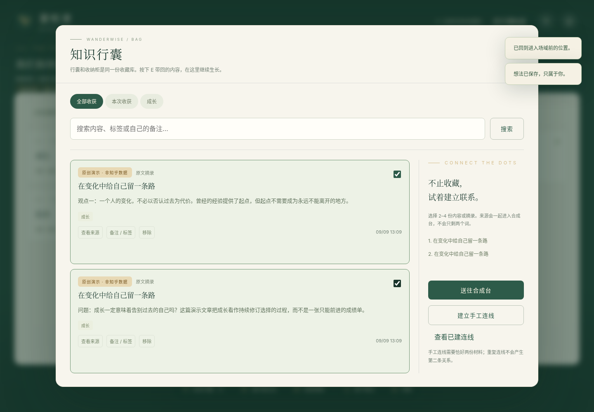
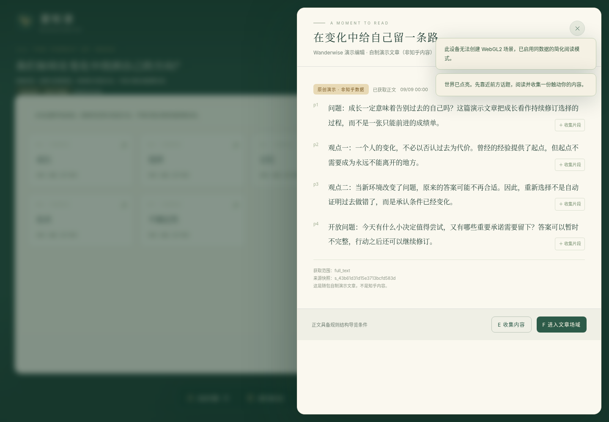
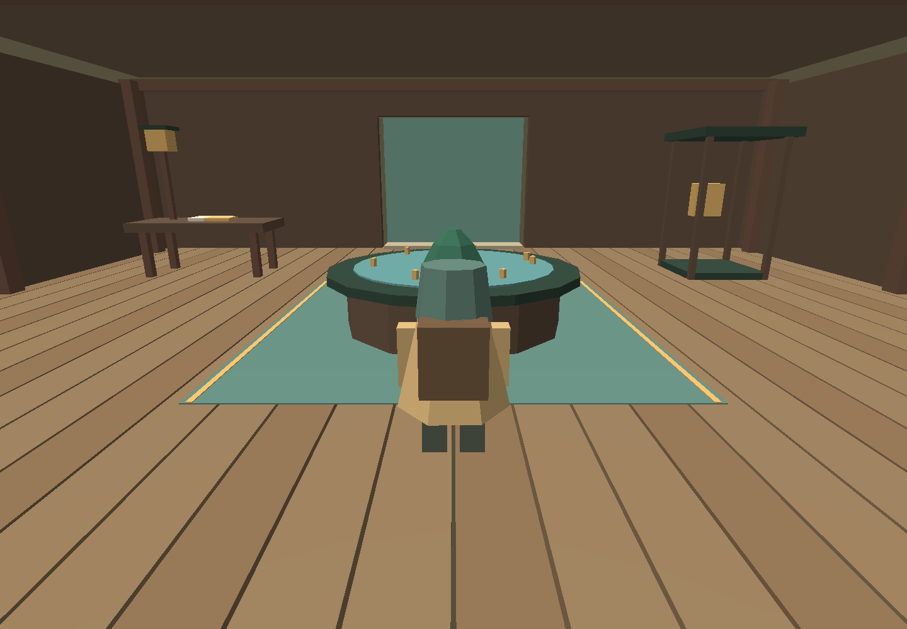
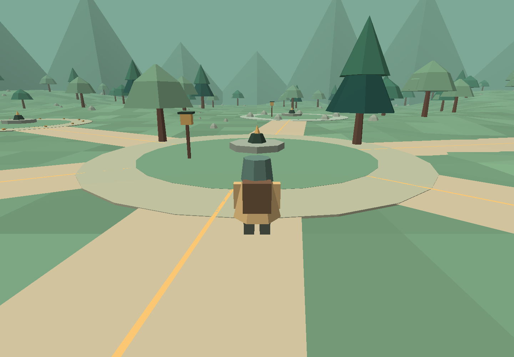

# 测试与交付状态

**结论：本地启动、持久化和指定范围的核心链路通过；不能认定全部 P0 完成。** 没有真实知乎/真实AI成功调用、没有公网部署，没有完成浏览器3D操作和性能验收。见需求追踪表逐项说明。

## 本轮环境

Linux x86_64 / glibc 2.41；Python 3.13.5；Node v22.16.0。FastAPI 0.128.2，Uvicorn 0.48.0，Pydantic 2.13.4，HTTPX 0.28.1，pytest 9.0.2，Playwright 1.57.0。受管理 Chromium 144.0.7559.96。

当前执行容器的外网下载/接口访问不可用；受管理浏览器对真实导航返回 ERR_BLOCKED_BY_ADMINISTRATOR，WebGL2 上下文不可创建。没有尝试绕过该策略。浏览器只能通过 about:blank 内加载代码做有限DOM测试，故另外区分本机HTTP测试和独立GLES3检查。

## 实际结果

| 项目 | 结果 | 能证明什么 / 不能证明什么 |
| --- | --- | --- |
| 后端集成与安全 | **21 passed** | 隔离临时SQLite与TestClient；来源、校验、权限、幂等、版本、检查点、事件、合成引用、模拟错误；不是21次真实API调用 |
| 引擎纯逻辑 | **10 passed** | 随机稳定性、归一化移动、矩阵/射线/BFS、几何、路径高度、简单碰撞、角色姿态、V三态；不是实机3D体验 |
| 前端语法 | **7个 ES Module通过** | 原生Node语法检查；不是完整浏览器兼容测试，也不是npm构建日志 |
| Python语法 | 通过 | backend/tests/tools/start编译检查 |
| 启动入口与真实本机HTTP | 通过 | 直接运行交付 `start.py --use-current --no-install`，HTTP健康/访客Cookie jar/世界任务/阅读/收藏/静态模块/SPA成功；不是浏览器Cookie策略验证 |
| 在线备份/恢复 | 通过 | 运行交付backup工具，完整性ok，备份含1条已确认收藏；停止服务、使用备份启动、新HTTP连接和原Cookie仍读到相同收藏 |
| 受限DOM/API联调 | **11个步骤通过，无pageerror** | 真实DOM与真实FastAPI业务；HTTP由进程内桥接、Origin由测试设置，history/localStorage/IndexedDB/UUID为替身；不能证明真实网络、CSP、浏览器存储与Cookie |
| 独立EGL/GLES3 | 通过 | 项目实际4个Shader编译、2程序链接；从实际JS代码导出几何离屏绘制；不是WebGL浏览器测试，没有运行中文SDF纹理完整视觉链路 |
| 官方Skill下载/真实知乎/真实AI | **未通过核验** | 未拿到成功响应；无有效性或额度结论；提供器为实现与模拟测试状态 |
| Docker/Caddy/公网HTTPS | **未执行/未部署** | 仅交付配置；没有可访问的公网URL |
| 帧率/长时/负载/新用户 | **未执行** | 不报告45FPS、P95、低画质30FPS、20分钟无泄漏、三人体验等未测指标 |

## 21项后端测试覆盖

健康检查不触发提供器；Origin/CSRF/HttpOnly；输入校验与不暴露凭证；创建世界幂等/冲突；正文/摘录精确来源；收藏唯一与重放；备注标签版本与无向连线；私人锚点语境/偏移/版本；两个访客私有资源隔离；场域段落来源与返回检查点；增量冻结和可通行图；标签页租约与暂停/归档状态；事件去重与停留边界；手工草稿保存与来源快照；拒绝不足材料和无证据话题；删除关系/清除个人数据；搜索模拟响应ID/URL/清洗/摘要边界；提供器缓存、鉴权/限流与ID安全；拒绝AI伪引用；SPA/API404及安全头；知识目录/详情模拟响应的无鉴权与章节范围。

以上详细定义和断言可直接查看 `tests/test_backend.py`，日志在 `evidence/backend.txt`。

## 2D 联调实际路径

访客小屋 → 演示世界 → 来源阅读器 → 两个不同摘录 → 正文场域进入/返回 → 创建私人锚点 → 行囊选材 → 手工洞察保存 → 暂停回家 → 日志 → 语义星图。

断言与浏览器版本见 `evidence/restricted-dom-results.json`。这里的“手工”明确不是模型生成；正文是本包原创测试材料。

下图是受限DOM测试中的实际界面截图，不是生成的设计稿，也不是公网WebGL截图：





## 离屏几何检查

固定七节点样例的静态几何：小屋1785三角形、12个简化碰撞体；主世界36973三角形、166个碰撞体。统计来自 `buildScene()` 导出，不包含浏览器最终动态文字/角色/导航绘制规模，不能据此承诺draw calls或FPS达标。

以下为独立EGL/GLES3离屏渲染：使用实际几何与Shader，但没有DOM覆盖层、中文浮动文字、浏览器输入和完整WebGL状态；**只证明该范围的几何/着色器可渲染**。





可重跑的辅助脚本：`tools/export_scene_test.mjs`、`tools/native_shader_check.py`。后者需要Linux EGL/OpenGL ES库以及NumPy/Pillow，不是产品运行依赖；受限DOM脚本为 `tests/restricted_dom_harness.py`，保留了测试替身说明。

## 真正浏览器测试另行执行

`tests/browser_e2e.py` 不使用网络、Cookie、IndexedDB或history替身。先运行服务并安装Playwright浏览器，再执行；本轮因环境策略限制，**没有把此脚本标记通过**。

```bash
python3 -m pip install -r requirements-dev.txt
python3 -m playwright install chromium
python3 tests/browser_e2e.py --base-url http://127.0.0.1:8000
python3 tests/browser_e2e.py --base-url http://127.0.0.1:8000 --require-3d --headed
```

第二条在基础DOM流程前检查WebGL2、鼠标捕获、人物位移、跳跃，然后切2D跑业务；仍不能替代3分钟路线/20分钟运行/全文字可读性等人工测试。

## 交付审查

没有实际开发者key、Token、访客数据库、字体文件、第三方付费模型或模拟成真实的知乎全文。自制资产与内容单独标识；P1/P2社交未开放。项目源文件、启动脚本和测试均随ZIP交付；前端本身是ES Module分发产物，不需要npm构建。

`MANIFEST.json` 记录逐文件SHA-256，可核对传输完整性，不是第三方签名。真实运行后生成的 data/reports/official-skill-local 均不随本次ZIP发布。
