# 真实运行图集

以下均来自本轮本地 Python 后端 + Chrome + Three.js 实际运行画面，不是商城图、Blender 离线图或 AI 图。默认中画质，1920×1080，DPR 1，关闭 Bloom/粒子。相机位置记录在 evidence/acceptance-viewpoints.json。

## 出生与全屋

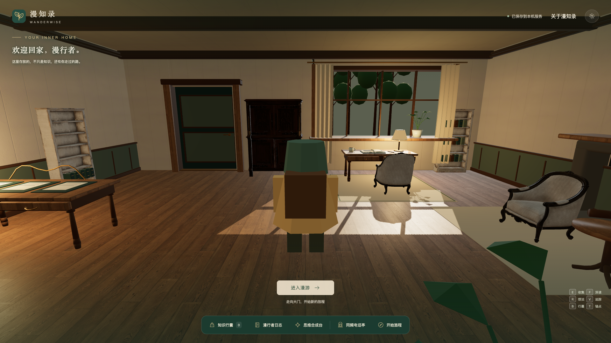
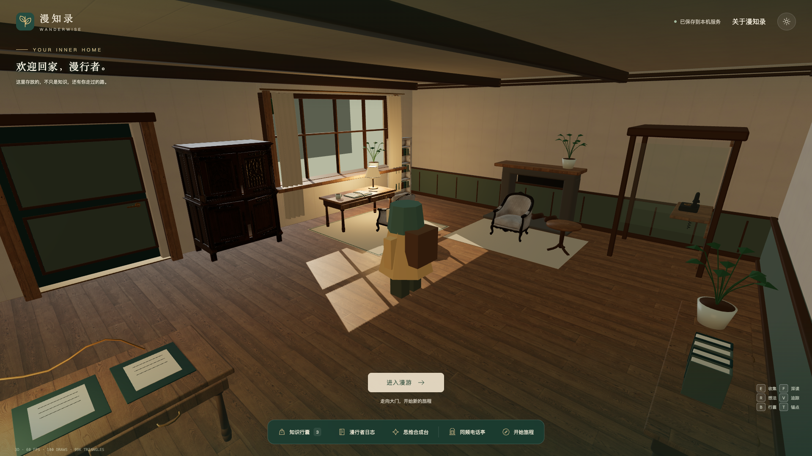

## 窗边与壁炉

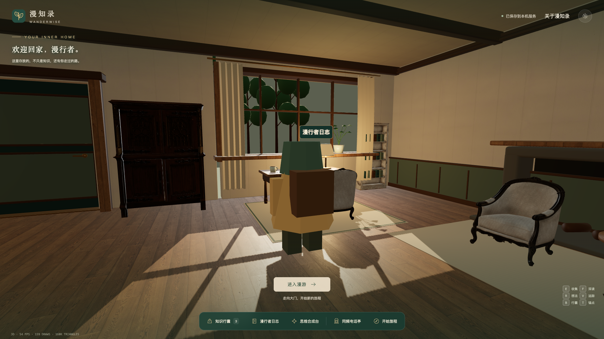
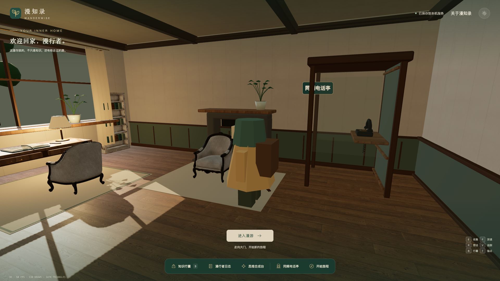

## 原业务设施

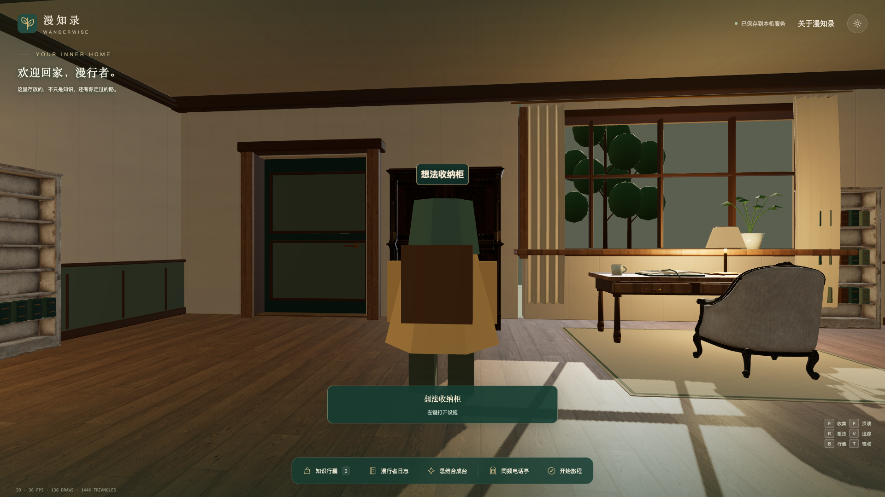
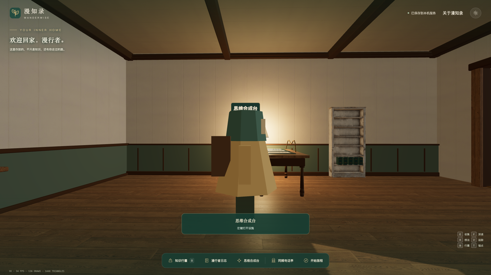
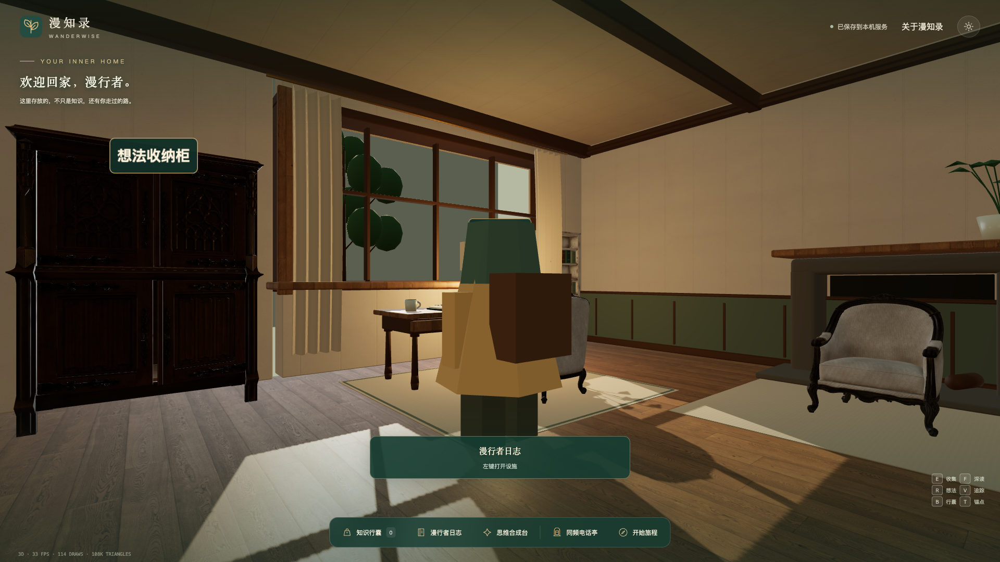
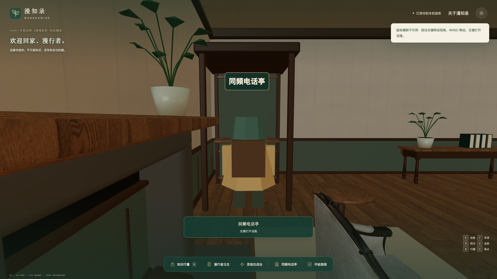
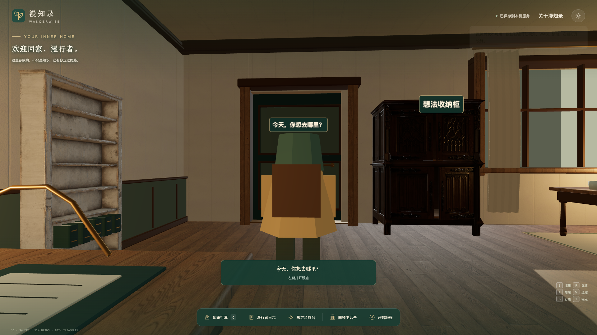

## 低画质与保留场景

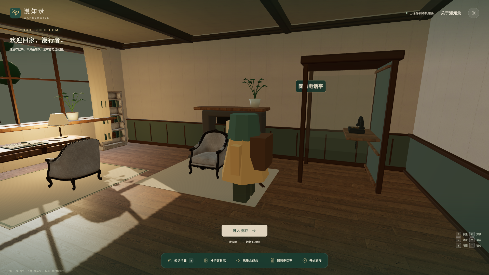
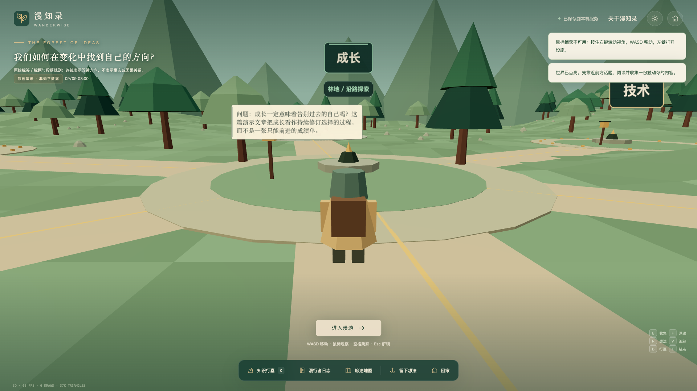
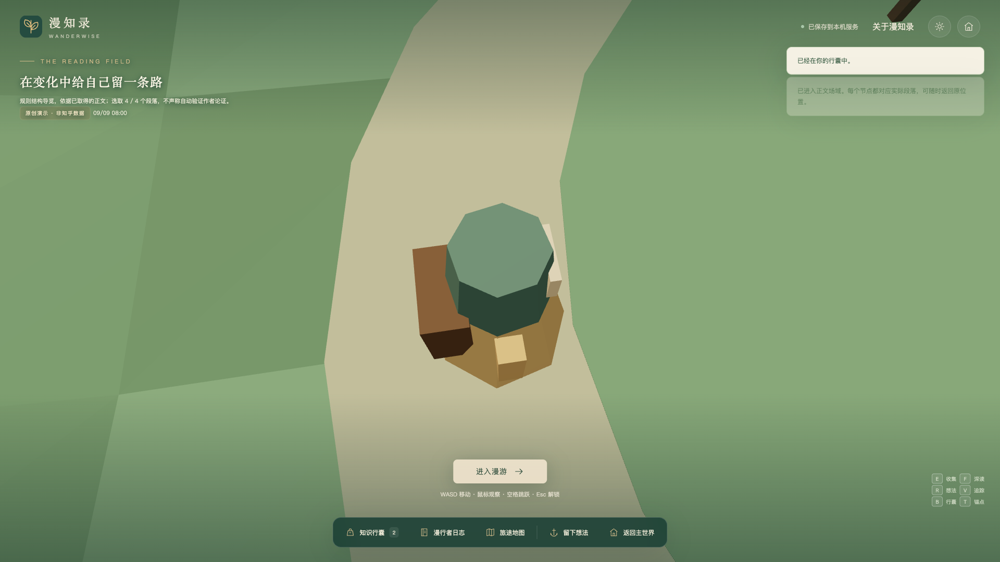

## 改造前的本轮浏览器截图

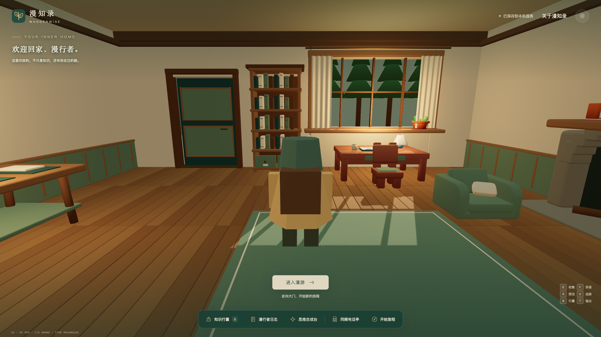

角色造型与主世界仍保留上轮风格；本轮重做范围为家园空间、家具材质和小屋物理。图集中没有隐藏这些差异。

## 实际输入漫游录像

[播放短漫游录像](evidence/home-walkthrough.webm)：真实 W/S 移动、右键拖动镜头、跳跃、暂停与日志面板，没有相机瞬移或离线画面。
