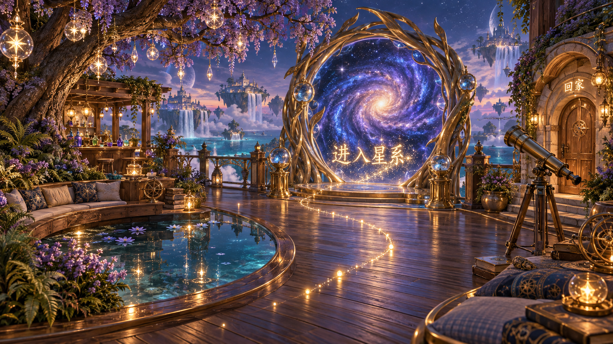
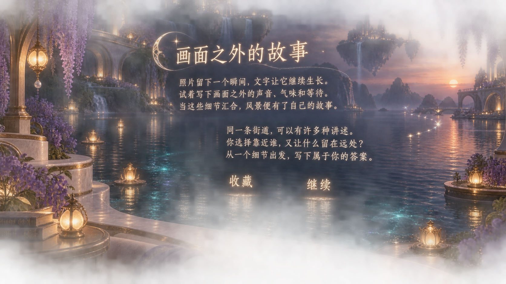

# 镜海群岛：场景文字四组概念

生成日期：2026-09-13。使用内置 imagegen 工具，每组单独生成。图为设计概念静帧；下述动效、交互均为待实现方案，不代表当前游戏已有行为。正文采用本次原创占位内容，不是知乎帖子或检索结果。

目标：文字由场景中的星尘、光、木纹和液体承载；取消文本框、面板、气泡及独立文字底板。文字的出现与消散可以流动，阅读阶段要稳定。

## A 星尘航标 · 观星台与星系入口

- 适用：进入星系、回家、目的地名称和短操作提示。
- 出现：靠近入口，周围星尘沿字形聚拢，形成“进入星系”；地面光路连接玩家与目标。
- 交互：注视使文字略微提亮，确认交互后星尘流入入口，触发场景过渡。凝视本身不直接触发传送。
- 保持：可交互期间字形稳定、位置固定在场景中；光路低于视线，不遮挡道路。
- 收起：离开范围后字形缓慢散为环境星光，主要出口保留柔和定位光。

## B 材质印记 · 小屋的收藏、阅读与合成

- 适用：书架收藏入口、阅读角、合成台及个人空间的日常操作。
- 出现：靠近后木纹内的金色字迹渐亮；桌面光墨沿笔画书写“新的想法”；玻璃球将文字与焦散投在墙面。
- 交互：选中书架、桌面字迹或阅读物件即可进入对应功能；以局部亮度和物件回应表明可操作。
- 保持：字形附着于材质，不漂浮追随镜头。正文应进入专门阅读状态，不全部刻到家具上。
- 收起：交互结束，字迹淡回木纹或环境反光。最终制作时取消可能围住字迹的装饰花边，保持没有文字边框。

## C 酒液诗篇 · 调酒与世界展开

- 适用：原料名称、配方反馈、酒名及调好后的传送过程。
- 出现：选入的原料带出各自颜色的液流和文字，汇入杯中；酒液波纹平稳后，酒名从液滴与蒸汽中成形。
- 交互：选择原料和比例驱动真实酒液与文字变化；完成调酒后，酒名末端化为通往对应世界的光路，杯中景象逐渐展开并自动传送。
- 保持：短暂展示清晰酒名和目的地；加载过程提供没有底框的“取消”，失败显示可操作的“重试”。
- 变化：图中“落日大道”为一例。其他九杯酒沿用交互节奏，分别使用露珠、树叶、音波、雨线等符合其世界的成字与展开方式。

## D 湖畔读境 · 帖子、文章与作品

- 适用：较长正文、比较阅读和个人作品查看；图中文字为原创示意文案。
- 出现：进入阅读点，视角平缓停在舒适位置，文字在空气中逐段显现；自然较暗的水面与远景提供对比。
- 交互：滚轮或触屏滑动切换段落；“收藏”“继续”等文字自身可选，不套按钮框。选中时亮度或字距轻微回应。
- 保持：正文使用稳定基线、足够字号和行距，前景段落接近同一阅读平面。水波和粒子继续运动，但不带动正文字形扭曲。
- 收起：收藏时少量光点归入随身收藏信物，退出时文字淡入水面反光；保留原阅读位置。
- 实现约束：图中较强的发光用于展示概念，正式正文需降低光晕。作者、摘要/正文标识、来源入口等信息以小字号独立排版，不能为追求美观丢失内容来源。

## 组合建议

四组可以作为同一套规则在不同空间分工：观星台使用 A，小屋使用 B，调酒过程使用 C，长文使用 D。只在出现、聚焦、确认和消散时播放明显动效，正文阅读时保持字形稳定。

搜索输入、想法编辑和异常反馈还需要后续单独验证；这四张图展示的是主要视觉方向，不代表已经覆盖所有界面状态。

## 交付文件

- 四张 PNG 均保留生成原图，未以程序修改图像。
- [prompts.json](prompts.json)：内置 imagegen 的四条完整生成提示词、生成方式和原始文件路径。

