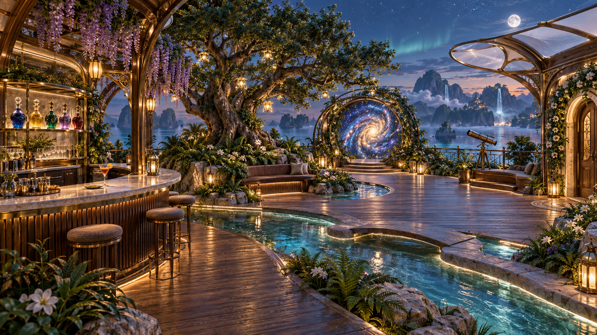
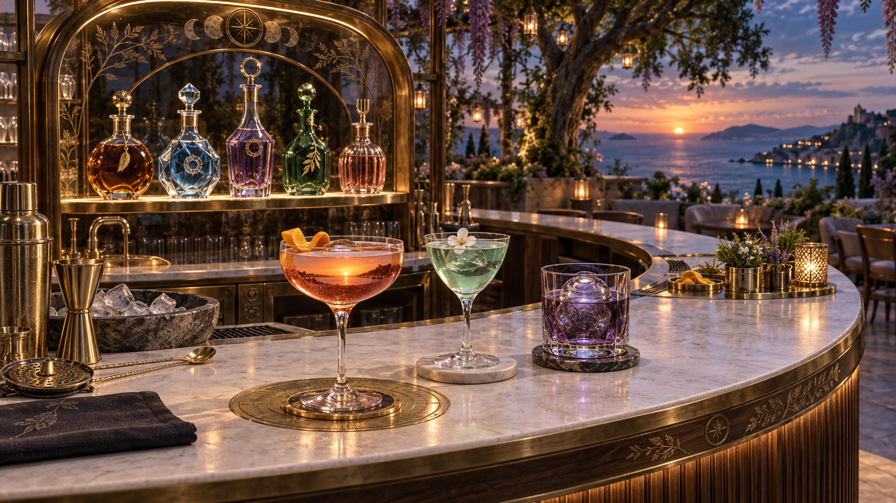

# 星树秘酿花园：观星台、调酒台与小屋功能设计

2026-09-14 · 设计审阅稿。基于当前 `20260914` 分支的实际实现；本轮只交付设计与效果图，不修改运行中的游戏。效果图表达美术目标，不能用来证明实时材质、动画或性能已实现。

## 1. 方向与现状

采用“写实的手工器物、奇幻的花园环境、清楚的知识活动”。让人先相信这是一处可以坐下、阅读、调酒的地方，再发现杯中世界、收藏星叶和银河入口。

当前并非完全没有布景：已有主树、外围花池、回廊、月池和星门。问题是这些部分的轮廓、高度、照明和活动联系仍不够鲜明。新增工作优先改变空间构图和细节层次，而不是平均摆满更多家具。

代码中的酒具主要依靠透明度和局部发光呈现，杯中内容也偏向一个平面效果。需要同时改善器形、玻璃体积、液面、冰块、反射环境以及玩家操作，单纯提高发光强度无法解决精致度。

小屋目前有七个有效交互点。合成台、资料柜、日志实际打开同一个 `PersonalPanel` 的不同页签；电话亭仍以故事人物的本地语句轮转为主。建议从“不同模型打开一个菜单”转向“每件物品对应一种行为和一种成果”。

## 2. 观星台：让花园形成完整空间

### 布局骨架

以当前约 22.4 米直径的平台为设计边界，不额外扩建一座巨型宫殿。保留左侧调酒、偏左主树、后方偏右银河门、右侧望远镜与回家门的识别关系。尺寸为制作目标，落地时仍需通过碰撞与视线检查。

- **左侧：秘酿花房。** 弧形调酒台置于半开放花房内，木拱、黄铜细肋与少量乳白玻璃花瓣构成头顶空间。背柜和高低花植包围工作区，玩家一侧敞开。
- **中部：收藏星树。** 一棵有真实枝干与树冠体积的主树。五个主题形成可辨认的星叶簇；新增收藏时一片光叶沿树干抵达对应枝头。弧形座椅嵌入树池，旁边保留能独处阅读的位置。
- **外围：花影回廊。** 木拱从调酒区延续到树后与回家门，黄铜植物纹样贯穿其间。紫藤只集中在两三段形成花幕；其他段落用攀藤、蕨类、白花与矮灌木逐层过渡。
- **地面：月牙水庭。** 浅水池顺着树池外沿展开，并通过一段窄水道联系花房。珍珠石池边可坐、可触碰；小桥保持水平桥面。清水、石底与焦散构成低处的细节。
- **右侧：安静的观测开口。** 望远镜、低靠背弧椅和岩生花丛构成一处观测角。回家门在独立暖光门廊内，从任意主要活动区都能辨认。
- **后方：星门与远景。** 银河门仍是最强视觉焦点。三处望海开口分别框住近处青碧海湾、中景花林岛、远处云瀑与山影；远景增强深度，不用密集高亮特效遮住银河。

主通路目标净宽不少于 2.5 米。花池之间形成明确边界，不能让草叶和桌角侵入必经通路。门、望远镜与星门的交互区不能重叠抢占按键。新增天棚不遮住仰望天空的主要视线。

### 层次与奇幻色彩

从地面向上分四层：低处的水光与珍珠岩岸，中层的坐凳和花灌木，肩部以上的垂花与弧形木肋，最高处的主树冠与少量吊灯。三种基本材质贯穿全场：深色胡桃木、旧黄铜、珍珠石；酒具和局部天棚提供精细玻璃对比。

色彩有分工：琥珀色照亮人物活动区；青碧色留给水；紫色集中在花幕；月光为树冠、栏杆和器物勾边。银河内部可以绚丽，但木材、石材和植物仍保留自己的颜色。阴影中保留形体，避免全场均匀泛紫或灯点过曝。

### 动态要发生在有意义的位置

| 触发 | 环境回应 | 对应意义 |
|---|---|---|
| 玩家触碰月池 | 涟漪从触点扩散，附近两三颗灯珠短暂呼应 | 感知身边环境，适合安静停留 |
| 正在调酒 | 杯中先改变，台面黄铜纹样响应，再向邻近水道传递一次低亮波纹 | 告知配方正在形成 |
| 收藏完成 | 一片星叶归入对应主题，局部枝头亮起后恢复 | 让内容增长可见 |
| 接近望远镜 | 镜口与附近星点依次亮起，目标话题名称显现 | 选择一个外界方向 |
| 银河入口就绪 | 环内星尘向深处缓慢旋转；门沿保持稳定 | 表达可出发，而不是常驻爆炸特效 |

植物主体继续使用静态精美建模，叶片与枝干固定连接。尤其不恢复此前被取消的整团叶片悬空旋转。自然动态主要交给水面、吊灯、少量布饰、云雾和稀疏萤光；阅读时进一步降低幅度。减少动态偏好继续有效，信息不能只靠动画传递。

## 3. 调酒台：酒本身先有吸引力

### 台面与酒具

目标是一座约 3.6 米宽的月牙形精调吧台：深色竖向木作、珍珠石工作面、细黄铜包边。玩家伸手可及的前侧保留干净工作区；配料位、冰槽与清洗位在两端，背柜嵌入花房。吧台仍属于同一座花园，而非另摆一个科技仪器。

五只原料瓶采用不同器形、瓶塞和小型雕刻符号：文学为琥珀圆肩瓶与羽笔纹，摄影为浅蓝切面瓶与光圈纹，哲思为紫晶收腰瓶与开放圆环，自然为青绿植物瓶与叶纹，音乐为珊瑚色细棱瓶与音叉纹。瓶内首先应看到可信的液体和留空，弱化现在偏玩具感的漂浮符号。

重点细节：薄而连续的杯沿、杯脚与杯底受力关系、玻璃内外壁、真实液体体积、液面弯月面、杯壁凝露、透明冰块、少量气泡，以及相互一致的反射与透射。金属工具具有拉丝方向和细小磨损；石面和木面有不同的粗糙度。装饰采用有选择的果皮、花、草本，不给每杯都套相同的星星粒子。

台上保留量酒器、长柄吧匙、摇壶、滤冰器、亚麻布和小型配料碟。三个完成态样酒形成展示重点，其余配方按需出现，避免十杯同时争夺台面和渲染预算。

### 十杯酒的器形与风景

世界身份、两种原料组合和现有旅程 ID 全部沿用；下面为视觉设计，不新增酒名或目的地。

| 酒名 | 器形与酒体 | 装饰和“杯中景” |
|---|---|---|
| 落日大道 | 薄壁碟形杯，琥珀橙向深处的梅紫过渡 | 一道柑橘皮；液面出现落日与沿岸光路 |
| 未寄出的答案 | 小型郁金香杯，烟粉与透明金色 | 细柠檬结；两束光从相对方向靠近，凝成远处邮局窗光 |
| 苔藓来信 | 圆腹短脚杯，苔绿与淡金 | 一枝细草本；杯底年轮间出现微小林间光隙 |
| 月光行板 | 修长香槟杯，银蓝酒体 | 一片白色花瓣；细气泡与水平光带缓慢起伏 |
| 镜外之问 | 切面短杯，透明液体中保留一层浅紫 | 一块几何透明冰；移动视角才看见另一重庭院倒影 |
| 露光标本 | 小型 Nick & Nora 杯，淡青向植物绿过渡 | 一块冰棱和一朵白花；露珠折射微观叶脉 |
| 蓝调快门 | 细长高球杯，深蓝与少量暖红反光 | 螺旋柑橘皮；雨线和街灯在液面形成三段节奏 |
| 树的时间 | 厚底短杯，茶金与深绿 | 单块大冰；液面慢慢展开几圈年轮，不让整杯旋转 |
| 回声悖论 | 烟紫古典杯，透明大冰球 | 一点苦橙皮；每轮涟漪仅改变一处，呼应旅程主题 |
| 林间慢拍 | 素净圆腹杯，淡青与草本绿 | 细长草叶；风纹穿过微小湿地倒影 |

### 调制是一段短而明确的动作

1. 靠近吧台后，视线柔和落到工作面；五只瓶子的名称沿瓶旁显现。
2. 点选两瓶，瓶子移动到工作区；量酒器与液位刻度表达比例。键盘和触屏提供等效操作，精细拖拽不是唯一方式。
3. 玩家可放入一段自己的问题或选中的材料。未主动选中的私人笔记不参与请求。
4. 确认调制后，倾倒、混合与装饰连续完成；玻璃外形保持清晰，液体的运动先于环境特效。
5. 酒名浮现在杯旁；对应场景先在液面中成为一小片可辨认风景。调制完成且加载就绪后，风景扩展并自动传送。

仍保留取消、失败、重试；不因取消而丢失配方和文字，自动传送只执行一次。目标视觉动画约 4–6 秒，并允许减少动态或跳过；实际加载慢时不能用无限调酒动画掩盖等待。当前比例主要影响配方描述和内容侧重，未来更细的路线差异需要另做逻辑，不能只改酒色就宣称已生成新世界。

## 4. 小屋：物件、行为与成果一一对应

| 物件 | 设计后的主要功能 | 玩家得到什么 | 实现边界 |
|---|---|---|---|
| 思想合成台 | 选取 2–4 份真实材料与一个问题，比较联系、分歧和反例，编辑成文 | 带来源的想法或作品 | 复用已有 AI 合成与手工编辑；无 AI 时仍能工作 |
| 私人资料柜 | 按主题存放、检索与取出收藏；来源、摘录和笔记分别呈现 | 可反复使用的材料库 | 和观星台星树、星系行囊共用同一份收藏，不复制三份数据 |
| 旅程日志书桌 | 展开地图、已到达停靠点与未完成的作品，继续原旅程 | 清楚的探索记录与下一步 | 将目前实物上的“继续阅读”改为准确的“继续旅程” |
| 观点回声电话亭 | 围绕同一问题，切换不同真实作者的公开回答，记录自己的追问 | 观点对照、收藏摘录与追问笔记 | 使用搜索和问题回答接口；首期不是实时语音或陌生人聊天 |
| 刘看山 | 帮玩家把问题说清楚、找到资料与出处，返回最近阅读内容 | 更好的检索方向和阅读陪伴 | 动作响应实际请求；不再新增一套重复聊天系统 |
| 书架与阅读椅（新增交互） | 摆放自己的作品、最近阅读和常读内容；坐下后继续读 | 稳定的个人阅读与作品空间 | 作品已有；精确阅读断点需新增前端记录 |
| 前门 | 带着选择的问题进入镜海陆地 | 观察、比较、实践与创作任务 | 复用陆地和旅程导航 |
| 阳台通路 | 到观星台接触外界、选择调酒旅程或进入银河 | 开始一段探索 | 保持回程门和出生点清晰 |

**合成台与调酒台的分工：** 调酒台用两种领域形成探索方向，产物是“一杯配方和一段旅程”；合成台把带回的真实材料发展成自己的观点，产物是“一份可编辑、有来源的作品”。两者通过材料库与旅程成果衔接。

**电话亭的具体体验：** 提起话筒 → 说出或输入一个问题（首期以文字输入为准）→ 拨盘选择不同公开回答 → 对照作者主张、依据与适用边界 → 收藏或写下追问。听筒旁的细光纹表现切换与加载，文字直接出现在视线中的安静区域；不显示虚构的在线状态、真人正在输入或无依据的同频百分比。没有足够不同观点时，就说明材料不足；不能为了制造争论而编造作者的立场。后续如加入朗读，仍需标明是内容朗读，不是作者与玩家通话。

## 5. 无框文字与操作

短名称沿器物、瓶颈、枝叶或门沿出现，选中后才逐层展开。长阅读内容进入稳定的近距离静读状态；合成时文字落在桌面纸张上，日志写在书页里，保留自然光标、选区和滚动，不回到一整块万能弹窗。不要把输入变成必须追着移动文字操作的小游戏。

进入阅读、打字或调制状态时暂停人物移动；退出恢复视角。桌面与触屏均能完成同一套核心行为。字幕、来源说明、完成与错误状态保留可读文本，静音和减少动态的玩家也能完成全部活动。

## 6. 后续制作顺序与验收

1. **先做一杯可信的酒。** 制作落日大道的完整杯体、液体、冰块、装饰和灯光样段，以玩家距离检查细节，再扩展三个杯型和五只原料瓶。
2. **再完成花房与景观连续关系。** 从调酒角到主树、月池、回廊、观测角逐段检查。先验证结构、高度和通路，再添加花幕与动态。
3. **将功能落到物件。** 优先分离合成台、资料柜、日志的展示；再重做电话亭，最后补书架与阅读断点。沿用公共缓存、个人资料和来源身份。
4. **统一氛围与分档。** 共享月光方向、风、水光和颜色配置。高档把材质预算优先给玩家手边的酒具与水面；远处使用简化表现，不让全场透明物件同时争抢效果预算。

验收重点：酒具近看透明但有体积，冰块不穿杯；植物静态形体完整；任意主要活动区都能找到回家门；至少三处清楚的望海开口；调酒取消与自动传送不回归；同一收藏跨空间一致；合成作品可编辑并有来源；电话亭提供真实内容且不冒充真人交流。效果图通过后，再以实时样段和行走录像验收动态、清晰度与性能。

## 7. 效果图

本轮使用内置 `image_gen` 绘制观星台全景与调酒台近景。二者共用主树、花房、弧形木作、珍珠石与黄铜的设计；画面中的折射、波纹和光效是目标预览。生成提示词随本设计保存。

### 观星台全景

花房式吧台、收藏星树、月牙水庭与银河入口通过连续木作和植物层次连接。效果图表达构图与材质目标，实际通路宽度、桥面尺寸和碰撞需在建模阶段校准。

### 调酒台近景

前景从左至右为落日大道、露光标本、回声悖论；背柜为五种知识原料。近景采用偏暖暮色展示玻璃、冰块、液体和金属的细节，与全景共用材质与器形设计。

[本轮完整生成提示词](./image-prompts.md)
