# 《漫思 Wanderwise》产品说明计划书

**一款以知乎内容为素材、以“天地人”为设计框架的 3D 第一人称交互式游戏**

> 仰望星空，酿造思想，把灵感种向远方。

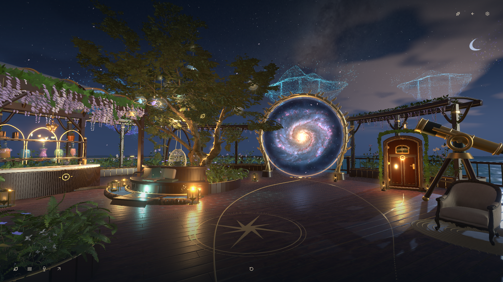

*实机图 01｜当前游戏中的观星台。星树、星门与调酒角共同构成个人居所通向知识世界的窗口。*

漫思把“发现知识—阅读思考—收集材料—组合灵感—完成作品”做成一段可以亲自走过的旅程。玩家以第一人称置身小屋、观星台、镜海与主题世界，环顾、行走、跳跃，靠近物件并打开它承载的功能；进入星空后，通过空间浏览与逐层深入探索知识内容。

**这是一个能操作、能阅读、能保存收获的三维游戏。** 本文展示当前运行版本的实际场景与交互界面，并说明它们背后的内容、数据与技术架构。

版本：2026 年 9 月 15 日　｜　游戏实机截图 + 功能说明 + 工程架构

<!-- page -->

## 一、我们为什么做这个

阅读时，我们常常遇到值得留下的一句话，却在下一次刷屏中忘记了它；收藏夹积累了很多内容，真正开始创作时，又不知道怎样把它们连接起来。

漫思想回答的是：**能不能让一次知识阅读，成为一段有位置、有行动、有收获的经历？** 玩家记住在哪里遇见一个问题，也记住自己为何停留、写下了什么、后来又怎样使用它。

知乎丰富而深刻的内容，以及广大网友积累的专业经验与生活智慧，是这个世界天然的素材宝库。一个问题可以打开一片星空，一段回答可以改变观察事物的角度，一次认真的批注也可以成为下一件作品的种子。

### 我们关注的体验问题

| 体验问题 | 游戏中的安排 | 希望留下的收获 |
| --- | --- | --- |
| 发现的内容零散，容易忘记探索过程 | 用星系层级组织内容，用足迹保留访问路径 | 能回到自己曾经深入的位置 |
| 收藏越来越多，却很少重新阅读 | 把收藏组织为星树枝叶，在小屋继续整理 | 让材料重新进入日常思考 |
| 读完有感触，却缺少自己的表达 | 选段批注，保留引文与个人理解 | 知道自己的想法从哪里开始 |
| 兴趣横跨多个领域，难以找到创作切口 | 把两个领域调成一杯思想之酒 | 得到一个具体的观察与创作方向 |
| 内容产品缺少个人空间感 | 让书架、收纳柜、合成台与日志承载不同功能 | 拥有能够反复回来的精神居所 |

这些是我们的设计出发点。产品效果仍需要通过真实游玩与用户反馈持续检验。

### AI 让知识世界的广泛构建再次拥有可能

AI 的到来，让我们有机会重新想象元宇宙。随着理解知识、组织材料和构建数字世界的门槛降低，一个允许更多人参与创造、共同建设的元宇宙，再次拥有广泛实现的可能。

我们希望用惊艳的视觉效果邀请人进入，用有意义的交互让人愿意留下，再通过高水平网友的参与，让专业经验持续成为新的主题与旅程。视觉、内容与创造共同构成这个世界的生命力。

<!-- page -->

## 二、AI 与知乎怎样参与游戏

知乎为游戏提供真实知识来源，AI 在玩家主动创作时帮助连接材料。玩家保留选择、判断与修改的权利。

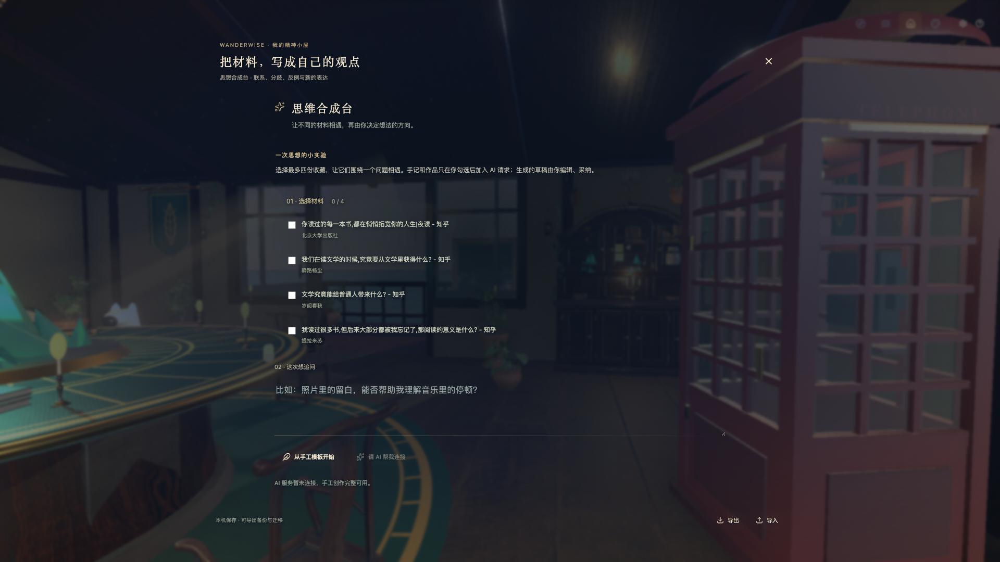

*实机图 02｜小屋里的思维合成台。此次截图显示手工创作可用、AI 暂未连接的实际状态；服务配置可用后，可请求辅助草稿。*

**内容进入世界。** 服务端接入知乎搜索、全网搜索、热榜、问题回答列表和公开知识作品。内容保留标题、作者、类型与原文入口。搜索摘要仍按摘要展示；实际取得的正文才进入相应阅读流程。

**材料进入创作。** 玩家最多选择四份收藏，并主动选入自己的手记或作品，围绕一个问题请求帮助。服务端读取可核验的公开来源，再由知乎直答能力辅助生成可编辑草稿。AI 服务是否可用，取决于部署配置、上游服务与调用额度。

**草稿成为作品。** 生成结果需要玩家阅读、编辑或采纳，之后才保存在个人空间。未使用 AI 时，手工模板仍可帮助组织问题、材料联系与后续行动。

十种主题世界已有固定场景定义。调酒选择目的地；AI 可以辅助整理材料和阅读建议。当前版本尚不支持运行时任意生成三维世界。

<!-- page -->

## 三、核心玩法：以“天地人”组织一段探索

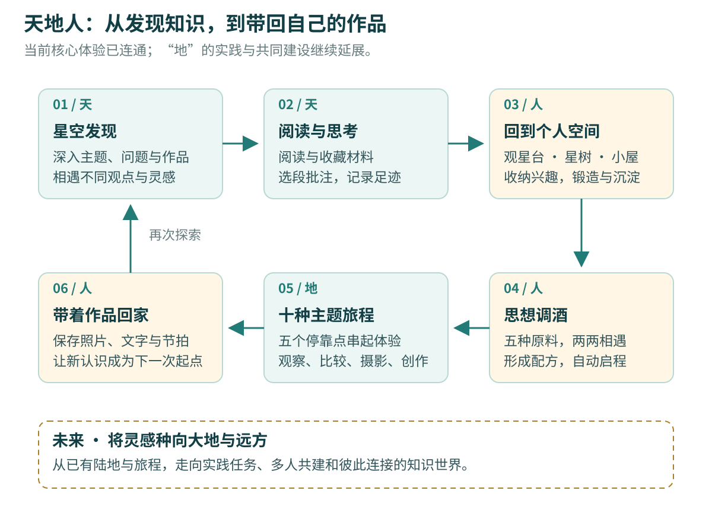

*说明图 A｜当前核心循环与未来方向。实线连接已有体验，虚线区域表示后续建设愿景。*

**天，是星空。** 星空承载开放知识、不同声音和陌生的可能。人在其中交流思想、探索、发散，收集属于自己的灵感。当前交流主要发生在对已有作者观点的阅读、比较与回应中。

**人，是小屋与观星台。** 小屋安放兴趣、收藏和作品；观星台保留向星空敞开的入口。人拥有自己的精神居所，也始终与更广阔的世界相连，这是我们对“天人合一”的表达。调酒台让不同思想的碰撞成为可感知的仪式。

**地，是灵感走向行动的地方。** 我们保留小屋，也因为它是人与大地接触的起点：从星空收集材料，在观星台和小屋中锻造、沉淀，再把自己的灵感带成种子，洒向大地与远方。当前陆地与旅程提供观察和创作练习，实践反馈与共同建设将继续生长。

<!-- page -->

## 四、实机演示与功能说明

### 4.1 星空探索：从一个方向，深入一份内容

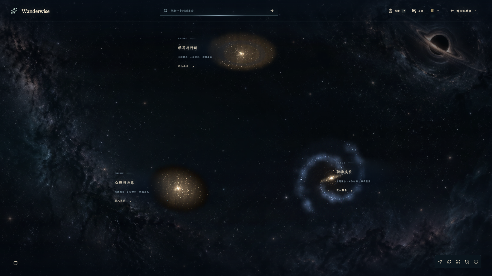

*实机图 03｜星空的内容层级与空间浏览。知识标题是可以进入的探索对象，保留完整文字。*

玩家从主题出发，逐层进入作品、回答与内容片段。远观时看到知识的分布，深入后阅读具体文本，再沿相关内容继续探索。星系拥有专属的空间浏览与自由飞行操作。

公共星空将真实知识作品按主题组织；实时搜索能够提供有明确归属的问题与回答。两种内容保持各自身份，作品集合不会被冒充为真实问题。

| 玩家动作 | 界面与世界的响应 | 内容意义 |
| --- | --- | --- |
| 选择一个主题或知识节点 | 镜头深入，展示下一层内容 | 从宽泛兴趣走向具体材料 |
| 进入作品与片段 | 打开可阅读文本与来源信息 | 从空间印象走向实际理解 |
| 继续探索或返回 | 保留探索线索，回到原来的内容层次 | 允许发散，也允许重新找到方向 |

**游戏中的空间承担内容导航。** 星空的层次让玩家知道自己正在哪里、接下来还能向哪里深入。

<!-- page -->

### 4.2 阅读、收藏与批注：把原文变成自己的思考

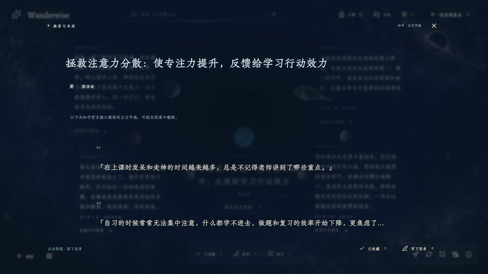

*实机图 04｜打开实际取得的知识内容，阅读正文或明确标注的节选，保留来源入口。*

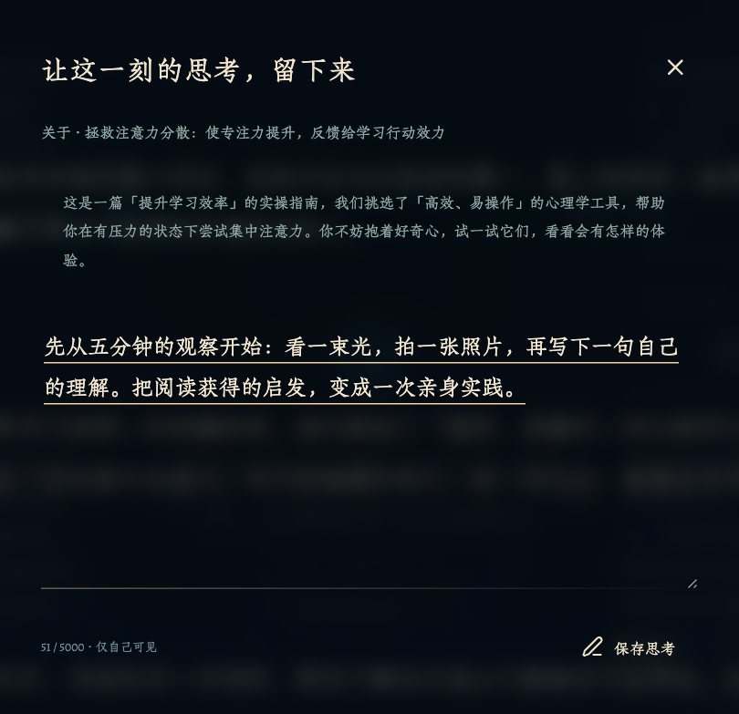

*实机图 05｜实际批注界面局部截图。选段后写下个人回应，原引文与个人表达分别保存。*

收藏留下材料，批注留下自己理解材料的方式。玩家可以写下疑问、联系或反例；下次阅读时，仍能找到当时触动自己的段落。截图中的文字来自实际内容界面与本次演示输入。

<!-- page -->

### 4.3 探索足迹：让灵感能够重新找回

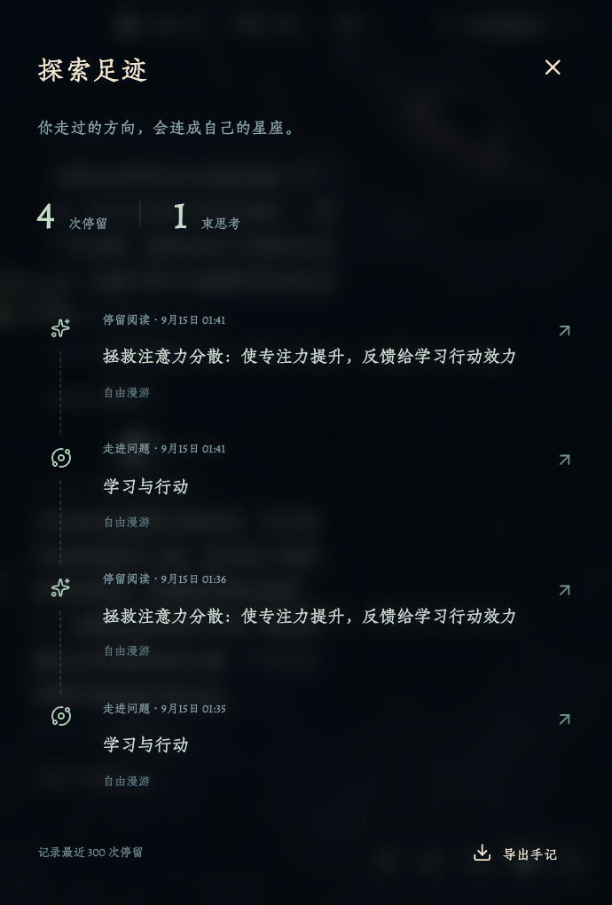

*实机图 06｜实际足迹界面局部截图。访问与回访产生探索记录，玩家可再次进入先前节点。*

一次有价值的阅读，常常来自连续几次看似随意的跳转。足迹保留这段过程，使玩家能重新找到“我是怎样来到这里的”。

足迹与收藏承担不同任务：收藏强调愿意留下的材料，足迹保留经过的方向；批注则保存玩家在某个位置形成的理解。三者共同支持长期探索。

玩家可以回访节点、继续深入，也可以导出旅行手记。它为个人思考提供可返回的线索，而不仅记录一次点击数量。

**一个使用场景：** 今天从注意力问题读到自然观察，明天想继续写作时，可以沿足迹找回那份作品，再读当时的批注，把它带入下一次旅程。

<!-- page -->

### 4.4 观星台与星树：让收藏成为身边的风景

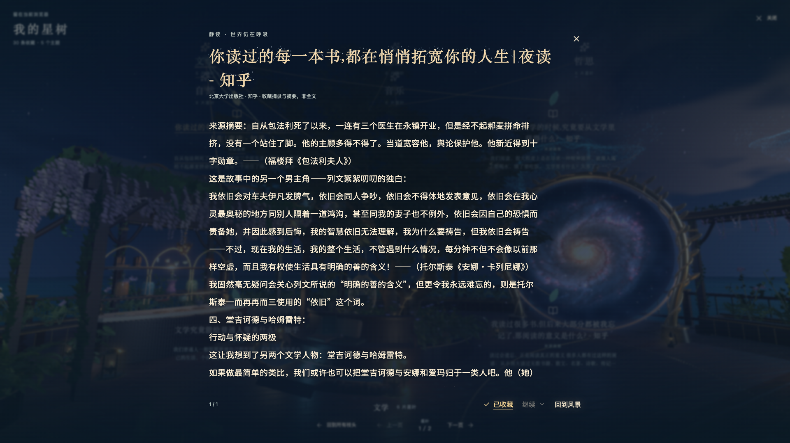

*实机图 07｜靠近星树后进入收藏枝条，选择叶片，打开当前保存材料的实际阅读界面。*

观星台既是自己的花园，也是向外探索的窗口。玩家可以从星门进入星空，回到树下重读收藏，再在调酒台开始新的旅程。

星树按主题或标签将收藏组织为枝条，每片叶子对应实际材料。进入叶片后，玩家静读保存的摘录、摘要和导读，也可以前往原文或管理收藏。自己的探索积累因此逐渐成为观星台的一部分。

| 所见之物 | 实际对应内容 | 可以完成的动作 |
| --- | --- | --- |
| 枝条 | 收藏的主题、标签或分组 | 找到感兴趣的一类材料 |
| 叶片 | 一份实际收藏 | 选择并打开阅读 |
| 树下阅读界面 | 摘录、摘要、来源和导读 | 重读、追溯原文、整理收藏 |

星树与小屋读取同一份个人存档。材料从星空被收藏后，可以在不同空间继续使用。

<!-- page -->

### 4.5 小屋：让每个物件都有明确用途

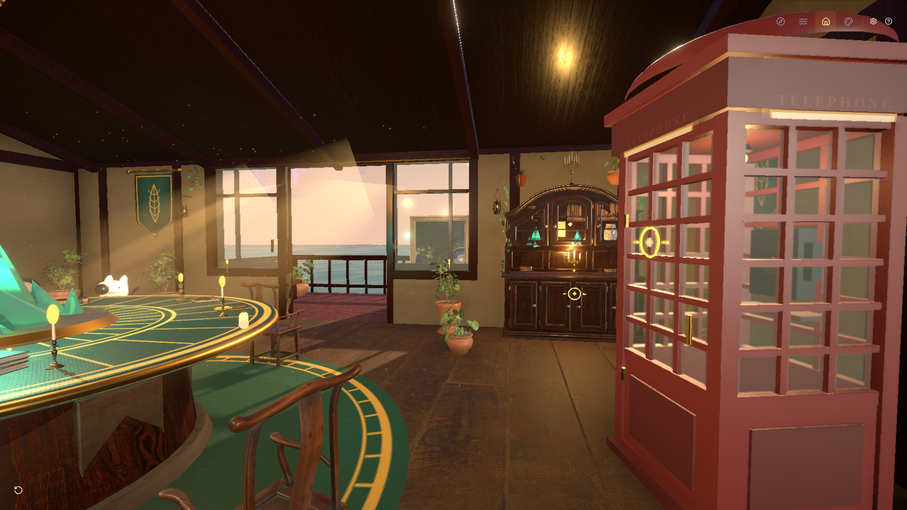

*实机图 08｜小屋第一人称视角。合成台、收纳柜、电话亭与阳台处于可观察、可行走的真实三维空间。*

小屋提供稳定的个人空间。玩家从外部带回的材料，在这里被整理、续读、比较和重新组织。

| 物件 | 当前功能 | 一次具体使用 |
| --- | --- | --- |
| 收纳柜 | 收藏与手记管理 | 找回星空里的材料与个人批注 |
| 私人书架 | 最近阅读、个人作品 | 续读，或重新打开摄影故事 |
| 思维合成台 | 材料组合与草稿创作 | 由两份收藏提出一个新问题 |
| 电话亭 | 同一真实问题下的回答比较 | 阅读不同作者立场，保存追问 |
| 漫行者日志 | 旅程、停靠点与完成情况 | 回到尚未完成的主题旅程 |
| 刘看山 | 立体阅读伙伴 | 找资料、查看兴趣与继续阅读 |

电话亭表达“听见另一种声音”，当前承载已有观点的比较；真人通话、用户匹配与多人实时交流属于后续方向。

<!-- page -->

### 4.6 个人空间：把材料保存，把表达留下

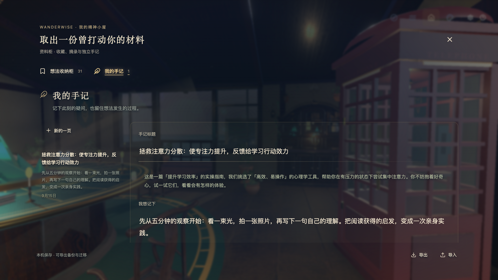

*实机图 09｜在小屋打开“我的手记”，读到刚才于星空保存的同一条批注。来源、引文与演示者的回应保持关联。*

小屋把收纳与创造连接起来：收藏进入材料库，批注保留个人判断，作品记录自己的表达，日志保存继续出发的位置。取消一份收藏，不会直接删除与之独立保存的手记。

个人资料保存在当前浏览器的 IndexedDB，支持 JSON 导出、校验与合并导入。玩家可以备份自己的积累，再迁移到另一台设备。当前尚未接入知乎账号同步或自动云存档。

**AI 创作时，玩家主动决定提交哪些个人材料。** 这些选定文字可以用于本次合成；私人笔记与生成草稿不进入服务端的公共搜索缓存。

刘看山作为小屋里的三维伙伴，也提供找资料、兴趣与续读入口。其位置、体积与动作参与室内场景；阅读和输入时，玩家的移动暂停，让注意力留给内容。

<!-- page -->

### 4.7 思想调酒：不同领域在一只杯中相遇

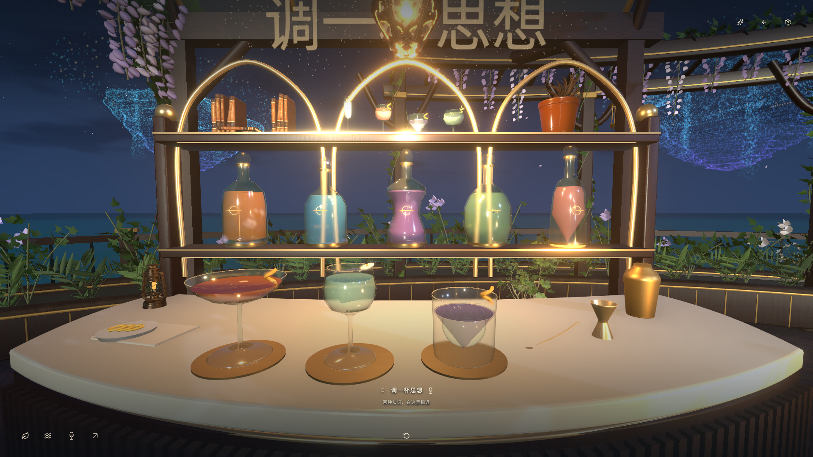

*实机图 10｜运行中的调酒角，展示实际酒瓶、杯具、材质与光照。*

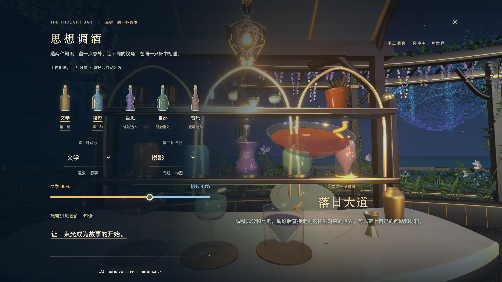

*实机图 11｜靠近后打开调酒，选择原料、比例与自己的想法。完成调制后，自动进入对应主题旅程。*

文学、摄影、哲思、自然、音乐是五种思想原料。玩家选择两种进行组合，比例调整阅读侧重点与有限的场景氛围参数；个人文字与选定材料让这次出发带上自己的问题。

<!-- page -->

### 4.8 落日大道：用行走、取景与文字完成作品

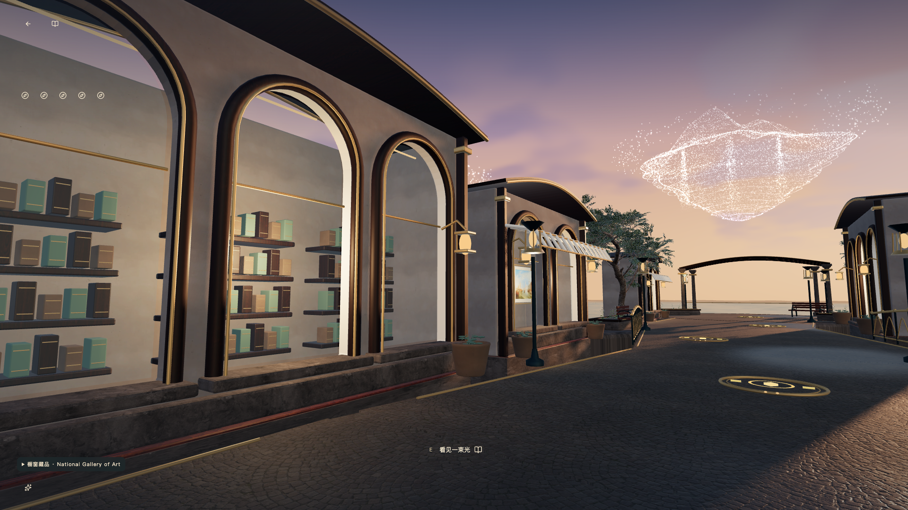

*实机图 12｜文学与摄影组合对应的落日大道。水岸、建筑与通路组成可以实际进入的观察环境。*

“落日大道”邀请玩家观察光线、画面内外的线索与叙事顺序。在五个停靠点之间行走，玩家阅读相关材料，再通过摄影与写作回应自己的问题。

摄影功能拍摄玩家眼前的游戏三维画面。关上手记，可以换一个观察位置；重新打开后继续拍摄，给画面写下说明，并交换开场与结尾，比较叙事怎样变化。

| 旅程阶段 | 玩家行动 | 得到的结果 |
| --- | --- | --- |
| 观察 | 走近水岸、书窗与画廊，改变视角 | 找到光、构图和细节之间的联系 |
| 记录 | 拍下三幅实景，写下画面说明 | 一组来自游戏现场的照片与文字 |
| 编排 | 调整顺序，比较开场与结尾 | 一份有个人表达的摄影故事 |
| 保存 | 保存活动草稿与作品 | 可以带回小屋继续修改的成果 |

旅程从场景到访延伸为具体创作，也为后续走向现实观察与实践建立起点。

<!-- page -->

### 4.9 创作活动：拍下眼前的三维风景

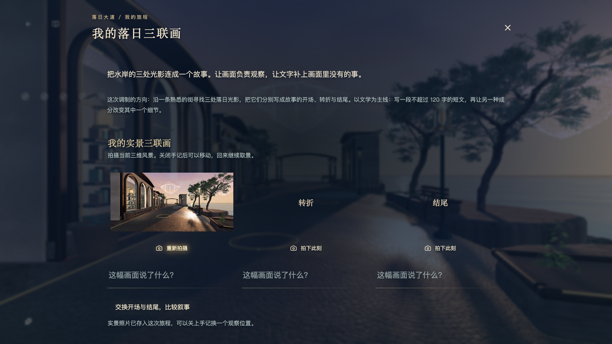

*实机图 13｜实际完成调酒与自动传送后，打开旅程手记并点击“拍下此刻”。第一幅照片已保存，转折与结尾等待继续取景。*

图中的第一幅照片直接来自当前游戏的三维画面。玩家可以关闭手记、移动到新的位置，再回来补拍下一幅；也可以重新拍摄，给每张照片写下说明。

这里的创作步骤与空间行动直接相连：走到哪里、朝哪个方向看、选择怎样的画面，会影响最后得到的作品。文字负责补充观察的理由和画面之外的想法。

完成三幅画面后，交换开场与结尾，可以比较同一组材料怎样形成不同的叙事。活动草稿保存在这次旅程中，作品可以放回小屋继续整理。

**本次实机截图已经验证：选择配方 → 调制 → 自动进入落日大道 → 打开手记 → 保存首幅实景照片。** 截图展示进行中的创作过程，不将待完成的位置作为已完成作品。

<!-- page -->

## 五、十杯酒，十种观察世界的方法

五种原料两两组合，形成十种固定主题世界。每种世界具有五个停靠点，配合相关材料与一项主要创作活动。

| 酒名 | 原料组合 | 空间与活动 | 可以带回的成果 |
| --- | --- | --- | --- |
| 落日大道 | 文学 × 摄影 | 落日水岸与画廊；实景取景、排序 | 摄影故事 |
| 未寄出的答案 | 文学 × 哲思 | 时差邮局；写下不同时间的选择 | 昨天与明天的两封信 |
| 苔藓来信 | 文学 × 自然 | 巨树信林；观察植物，再换位写作 | 观察记录与植物来信 |
| 月光行板 | 文学 × 音乐 | 月下水上舞台；文字、节拍与停顿 | 带节奏的文字 |
| 镜外之问 | 摄影 × 哲思 | 取景庭院；改变范围与解释 | 取景对照与个人判断 |
| 露光标本 | 摄影 × 自然 | 微观庭园；比较尺度、形态和纹理 | 三幅实景标本与说明 |
| 蓝调快门 | 摄影 × 音乐 | 雨夜街巷；影像与八拍节奏 | 图像与节拍编排 |
| 树的时间 | 哲思 × 自然 | 年轮庭园；比较改变与延续 | 时间比喻与反例 |
| 回声悖论 | 哲思 × 音乐 | 共鸣殿堂；逐次改变一组音符 | 对旋律身份的思考 |
| 林间慢拍 | 自然 × 音乐 | 湿地与风声森林；编排三轨节拍 | 合成声景与文字 |

声音活动使用合成音色，并提供视觉节拍反馈，静音时也可以观察与编排。每次出发创建独立旅程实例，保存本次进度、草稿与照片。

### 一次完整游玩

以“注意力与自然”为例：在星空找到关于专注力的真实作品，为“到安静的户外，听听自然”写下一条批注；沿足迹回访，回到星树重读，在小屋整理材料；把文学与摄影调成“落日大道”，带着自己的问题出发，最后用三幅场景照片和文字完成故事。

**同一份材料，可以从知识来源走向个人批注，再成为创作的起点。** 这条连续路径是“天人合一”核心体验的重要组成部分。

<!-- page -->

## 六、工程架构

漫思采用 **React + TypeScript + Vite / Three.js / Node.js + Express**。浏览器负责三维画面与玩家交互，服务端提供内容、来源与 AI 能力，个人存档留在玩家当前浏览器。

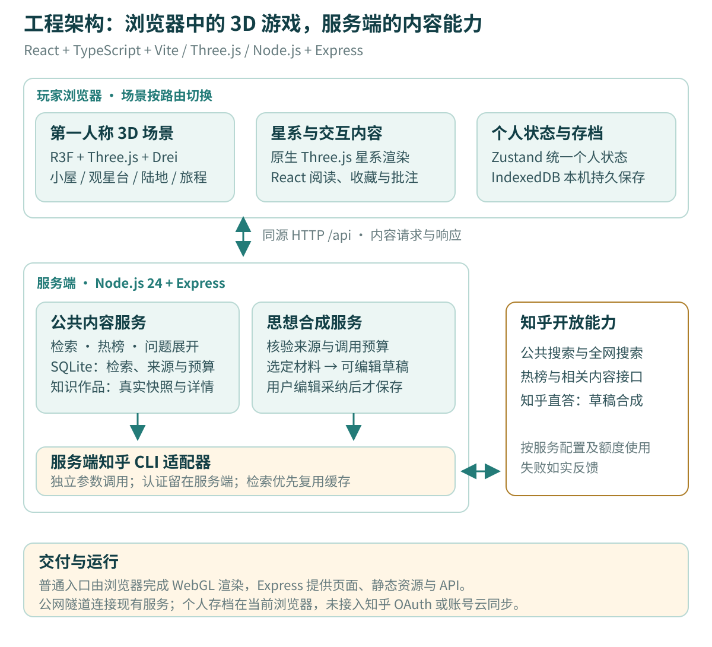

*说明图 B｜根据当前代码整理的主要架构。普通游戏入口采用浏览器 WebGL 渲染，公共内容与个人存档分别保存。*

小屋、观星台和旅程通过 React Three Fiber 组织三维场景；星系使用原生 Three.js 渲染器。它们按路由切换，通过统一的个人数据层衔接收藏、批注与旅程状态。

<!-- page -->

### 6.1 技术选型与职责

| 层级 | 当前实现 | 承担的职责 |
| --- | --- | --- |
| 界面与应用 | React、TypeScript、React Router、Vite | 页面路由、阅读与编辑界面、按需加载 |
| 实时三维 | Three.js、React Three Fiber、Drei | 小屋、观星台、陆地与旅程的场景、相机和模型 |
| 星系空间 | 原生 Three.js 与 React 文字叠层 | 星体、粒子、镜头深入、内容选择与标签投影 |
| 玩家控制 | 自定义控制器、地面与障碍判断 | 第一人称视角、行走、跳跃、靠近互动和触屏 |
| 状态与个人存档 | Zustand、IndexedDB、数据校验与迁移 | 来源、收藏、笔记、作品、旅程、返回位置 |
| 内容后端 | Node.js 24、Express | 同源 API、参数校验、来源适配和错误反馈 |
| 公开缓存 | SQLite 与公开知识快照 | 检索复用、公开来源、获取时间与调用预算 |
| 知乎接入 | 服务端 CLI 与公开知识接口 | 搜索、全网来源、热榜、回答列表及作品详情 |
| 思想合成 | 服务端 SynthesisService、知乎直答 | 根据选定材料生成可编辑、可核对的草稿 |
| 资源与部署 | GLB/GLTF、PBR 贴图、静态构建、公网隧道 | 加载场景素材，以网址提供实际体验 |

### 第一人称体验的实现重点

**视角与身体位置一致。** 相机跟随玩家的实际可行走位置，移动经过地面和障碍判断；空格触发跳跃。小屋门口、阳台与返回位置共同构成往返路线。

**提示随距离出现。** 平时通过暖色高光与材质差异标记可互动位置；靠近后显示操作文字，打开功能后完整展示正文与表单。阅读和输入时暂停移动。

**光影按预算运行。** 模型、材质、环境光、阴影和自定义水面共同形成氛围。不同画质档位控制水面细分、阴影及反射更新；场景按需加载。效果目标与实际帧率验收分别记录，不将目标写成所有设备的性能保证。

<!-- page -->

### 6.2 数据如何在星空、星树与小屋之间流转

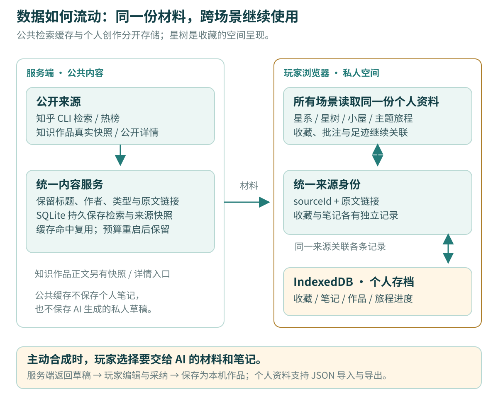

*说明图 C｜同一来源关联不同场景中的收藏、笔记与作品。公共检索结果可以复用，个人表达保持独立。*

**公开内容层：** 检索优先读取 SQLite，相同并发请求合并，预算持久保存。公开知识作品另有真实快照和详情入口，不能将所有正文都理解为搜索摘要缓存。

**个人空间层：** 来源按身份与原文链接规范化，收藏与笔记有独立记录。状态变化写入 IndexedDB，星树与小屋读取同一份资料。旧数据通过迁移接入，并支持备份、导出和合并导入。

**跨场景返回：** 旅程记录保存实例、停靠点与位置；进入星系时建立返回锚点，使玩家能够回到刚才的旅程继续。

<!-- page -->

### 6.3 内容与 AI 请求怎样完成

| 请求 | 处理过程 | 玩家获得什么 |
| --- | --- | --- |
| 查找材料 | 浏览器 → 内容 API → 查询缓存 → 必要时调用知乎能力 → 规范化结果 | 标题、作者、摘要、原文链接与获取信息 |
| 展开知识 | 星空内容层级 → 公开快照或详情接口；真实问题按归属展开回答 | 可核对身份的作品、回答与片段 |
| 保存收藏或批注 | 用户操作 → 统一个人状态 → IndexedDB | 可被星树与小屋继续使用的记录 |
| 请求思想合成 | 主动选材料 → 来源与预算校验 → AI → 结果及引用校验 | 可编辑草稿，采纳后成为本机作品 |
| 调酒进入世界 | 原料与比例 → 预设世界映射 → 独立旅程实例 → 场景路由 | 具有个人进度与返回位置的一次旅程 |

AI 不在每次阅读时自动运行。普通内容阅读保留真实文本，辅助创作由玩家主动发起。私人的手记与 AI 草稿不会进入其他访客可复用的公共搜索缓存。

服务端以固定路径和独立参数调用 CLI，认证配置留在服务端。游戏直接打开网址即可体验；当前没有知乎 OAuth 登录与账号云同步。

### 主要入口与代码模块

| 模块 | 代码位置 | 对应体验 |
| --- | --- | --- |
| 页面路由 | `src/App.tsx` | 小屋、观星台、星空、陆地、旅程 |
| 个人空间 | `src/features/personal/` | 收藏、笔记、作品、迁移与星系桥接 |
| 星系 | `src/features/galaxy/` | 空间探索、阅读、批注和足迹 |
| 观星台 | `src/components/observatory/` | 星树、调酒、星门与花园 |
| 主题旅程 | `src/features/journeys/` | 十世界定义、五站进度与创作活动 |
| 公共内容与合成 | `server/content/`、`server/galaxy/` | 知乎接入、缓存、来源与 AI 请求 |

<!-- page -->

## 七、当前成果与创新点

### 当前已经能够体验什么

第一人称小屋、观星台、陆地与十种主题旅程已经建立；星系的内容探索、阅读、收藏、批注、足迹回访与个人空间已经连通。调酒可以选择世界，旅程提供观察与创作活动，成果能够保存后继续使用。

**我们将这一阶段概括为：“天人合一”的核心体验已经形成，“天地人”的完整体系正在生长。** 实时检索和 AI 辅助依赖所在部署的服务配置、上游可用性与额度。

### 三个相互支撑的设计尝试

**把知识路径变成空间体验。** 玩家从主题深入材料，在阅读后回访足迹；距离、方向和停留共同参与知识导航。

**把个人积累变成可以回来的居所。** 星树、小屋与各个物件承载真实收藏和功能，让“我的材料”逐渐拥有自己的位置。个人空间与开放星空相通，表达天人合一。

**把跨领域思考变成可操作的仪式。** 调酒把两种兴趣的组合变成明确动作，再用旅程中的取景、写作与节拍活动继续展开。玩家在阅读之后有机会完成自己的表达。

这些尝试通过同一份材料和存档连接起来。作品的价值，在于让发现、理解与创造成为可以连续经历的过程。

### 接下来的方向

| 方向 | 下一步希望实现的体验 |
| --- | --- |
| 大地与现实实践 | 带着问题完成观察与实践，再把新的经验带回小屋 |
| 创作者参与 | 由高水平网友策展主题与旅程，让专业经验形成更深的内容路径 |
| 公共世界与共建 | 让个人作品相互连接，逐步发展多人交流与共同建设 |
| 账号与长期保存 | 建立独立授权流程，发展跨设备同步与个人空间延续 |

多人实时互动、公共共建、知乎账号同步及任意生成三维世界仍是未来方向，不作为本版已实现功能展示。

<!-- page -->

## 八、愿景与体验入口

我们期待，知乎丰富的内容、惊艳的视觉效果、有意义的交互，以及广大高水平网友的持续参与，能够共同打开知识生态的新空间：让每个人既能获得知识，也能用知识创造，再让这些创造彼此启发。

**让知乎成为知识世界的 Minecraft，让知识能够被探索、组合与共同建造；也努力孕育知识创造领域的“黑神话”——以鲜明的中国文化表达、出色的审美与原创交互，打开人们对知识产品的想象。**

Minecraft 对应共同建造的愿景，“黑神话”对应文化表达与原创品质的追求。我们愿意从已经连通的天人合一出发，持续完成天地人三才的体系。

### 直接体验

- [打开观星台，进入游戏](https://eau-recorded-gap-decor.trycloudflare.com/observatory)
- [查看三分钟实机演示与下载](https://range-diploma-exams-jones.trycloudflare.com/showcase)
- [Destroyertubu / ZackThon 项目仓库](https://github.com/Destroyertubu/ZackThon/tree/20260914)
- [Wood3307 / Wanderwise 项目仓库](https://github.com/Wood3307/Wanderwise/tree/20260914)

建议电脑浏览器体验：鼠标环顾，WASD 或方向键行走，Shift 快走，空格跳跃，靠近后按 E 互动。手机提供触屏操作。星系采用自己的空间浏览操作。首次进入需要加载三维资源，当前公网地址由临时隧道提供，隧道重建后可能改变。

### 实机图与说明图的来源

本文功能图片直接来自当前项目在独立浏览器存档中的实际运行截图，拍摄日期为 2026 年 9 月 15 日；没有重绘前端或使用概念图代替游戏。固定镜头用于场景取景，功能界面通过项目现有操作打开。演示文字与存档属于本次截图使用的独立环境。

说明图 A、B、C 分别解释玩法、架构与数据流，根据当前代码绘制。图片原文件与可编辑 SVG 随文档一同提供。当前主线代码分支为 `20260914`，另保留独立演示分支 `codex/judge-showcase-20260914`。

### 项目广场短介绍

漫思 Wanderwise 是一款基于知乎内容的 3D 第一人称交互式游戏。玩家在星空探索知识、收藏批注，回到小屋整理思想，在观星台把文学、摄影等领域调成一杯酒，进入对应旅程，完成取景、写作与节奏创作。我们以“天地人”组织体验，已连通“天人合一”的核心路径，并将继续让灵感走向实践，让用户用知识共同建造世界。
