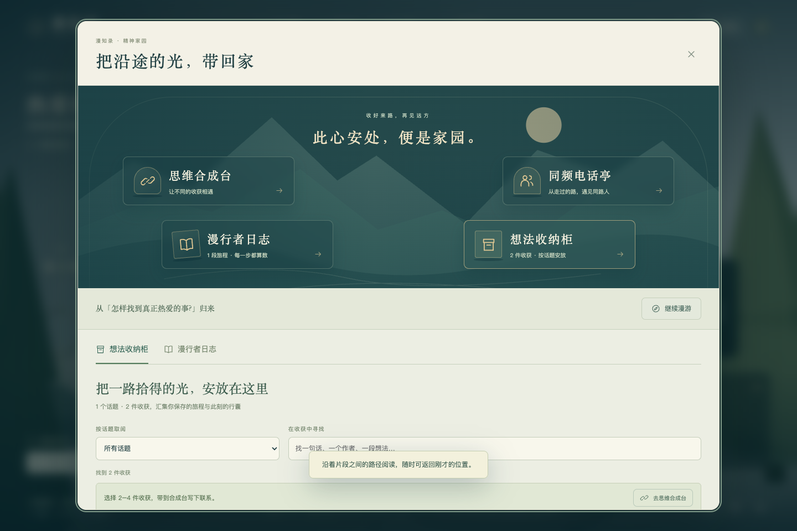

# 漫知录 · v1.1.0

> 把问题，走成自己的路。问题是世界的种子；行囊里的知识，应该彼此相遇。

一个以问题、困惑或话题词为种子的第一人称 3D 词云探索游戏。自由飞行，进入文章场域，收纳观点，留下想法，再把旅程带回精神家园。版本 1.1.0 按更新后的玩法文档实现，沿用 SQLite 存档与真实访客间的公开路线匹配。



## 0. 当前可玩的功能

| 玩法 | 行为 |
| --- | --- |
| 自由探索 | WASD 移动，Shift 上升、Ctrl 下降，鼠标视角，滚轮缩放；空白种子可随机出发 |
| 准星交互 | 话题周围浮现文章片段；左键阅读，E 收纳选中的片段，F 进入文章场域，V 自动追踪话题 |
| 文章场域 | 按已有文本顺序组织子地图；Q 或返回按钮恢复主世界原位置、视角与缩放，子地图移动不污染主世界存档 |
| 精神家园 | 思维合成台、同频电话亭、漫行者日志、想法收纳柜；跨旅程归类、搜索、回顾与合成 |
| 共鸣与评论 | 首次跨用户阅读 +1；每人每锚点最多三次连鸣，支持评论与持久化通知；分发按共鸣排序 |
| 词云小径 | 我的足迹／同频人足迹／全员热门小径；公开路线叠加数量决定连线亮度与粗细 |
| 保存与恢复 | 原生 IndexedDB 本地备份、SQLite 服务端存档、乐观版本校验、Markdown/JSON 导出；兼容旧版无高度的存档 |
| 知乎接入 | `python run.py --live` 使用官方 CLI 的系统凭据；搜索结果写入本地 SQLite，默认不过期，重复查询不消耗额度 |

[版本更新记录](CHANGELOG.md) · [本次实现与验证记录](docs/RELEASE_1_1.md) · [实时模式启动](docs/LIVE_START.md)

默认使用明确标记的原创演示内容。实时搜索失败会展示错误，不混入演示数据。文章场域组织的是接口实际返回的文本；搜索摘要不会被标记为全文或逐字金句。公开锚点沿用审核流程，热门路线仅统计主动公开的快照。当前身份仍是浏览器访客；知乎 OAuth、完整关注流、故事/知识 API 尚未接入作品。

## 1. 快速启动

建议 Python 3.11+；本次后端检查环境为 Python 3.12。Three.js 路径需要 Node.js 20.19+；本次检查使用 Node.js 24；纯软件兼容模式不需要 Node。不要双击 `index.html`：需要通过服务器访问。

### macOS / Linux

```bash
cd 漫知录
python -m venv .venv
source .venv/bin/activate
python -m pip install -r requirements.txt

# 推荐：安装 Three.js，开启增强渲染。外网可用时执行。
npm ci

python run.py
```

浏览器打开 `http://127.0.0.1:8000`。

### Windows PowerShell

```powershell
cd 漫知录
py -m venv .venv
.\.venv\Scripts\python.exe -m pip install -r requirements.txt
npm ci
.\.venv\Scripts\python.exe run.py
```

**npm 下载不可用时**，跳过 `npm install` 仍能启动软件三维版本。稍后安装成功，需要重启 Python 服务器，才会挂载 Three.js 的静态目录。不是需要手工改前端代码才能运行。

依赖首次安装需要联网；安装完后，演示模式不依赖公网 CDN、字体、纹理或知乎账号。实时模式当然仍需要连接知乎。

改端口或通过其他域名访问时，同时修改 `.env` 中的 `ZHIYE_ALLOWED_ORIGINS`，否则安全检查可能拒绝写入。通过公网使用时请先阅读“上线前必须补齐”。

### Docker

```bash
cp .env.example .env
docker compose up --build
```

默认仅映射到本机回环地址，不会主动暴露到公网。数据库在命名卷 `zhiye-data` 中。构建需要联网安装依赖。已提供经本机安装验证的 `package-lock.json`，Docker 使用 `npm ci`；本次未执行 Docker 镜像构建。

## 2. 怎样完整体验一轮旅程

在首页填写问题、话题词，或点击“随心出发”。进入世界后，用准星选中浮空内容卡，按 E 收入行囊。自由飞向其他话题，停留后出现内容与新的方向。按 V 可追踪选中的关键词，方向键可取消。

按 B 打开行囊，选中 2–4 张卡，选“互相补充 / 形成分歧 / 跨界类比 / 因果假设”，写至少六个字说明联系，再生成“新问题 / 观点草稿 / 行动实验”。产物不是引用，也不被标为已证实事实；原卡片、来源 ID、联系类型和你的解释全部保留。

按 F 进入选中文章的场域，按 Q 返回；按 R 留下自己的想法，按 T 阅读同话题锚点并共鸣、评论。按 H 回家，在柜子中归类收获、跨旅程合成，在日志中回顾思考与路线。按 M 切换三种画布视图。

保存旅程后，在“同频的人”中查看公开范围预览，主动勾选确认并公开。用另一个浏览器/隐私窗口创建独立访客，探索并公开一条路线，双方才会进入真实匹配列表。单人使用时列表为空，这是正常行为，不是数据未加载。

### 操作

| 操作 | 方式 |
| --- | --- |
| 移动 / 上升 / 下降 | WASD 或方向键 / Shift / Ctrl |
| 视角 | 进入探索后鼠标移动即转动视角，无需按住；浏览器允许时自动锁定鼠标 |
| 释放鼠标 | Tab / Esc；点击场景恢复跟随。打开面板暂停，关闭后恢复 |
| 阅读准星选中的卡 / 文章场域 | 鼠标左键 / F；Q 返回主世界 |
| 收纳准星选中的片段 | E |
| 想法 / 阅读他人想法 / 行囊 / 画布 / 家园 | R / T / B / M / H |
| 自动追踪 / 缩放 | V / 鼠标滚轮 |
| 触屏 | 左侧方向按钮、场景拖拽、底部导航；也可以地图直达 |
| 暂停人物移动 | 打开任意阅读、行囊或设置面板时自动暂停 |

“减少动态效果”关闭背景漂移与水面动画，并关闭 GPU 泛光；没有镜头摇晃和强制跳跃。页面失焦会清除移动键状态。

## 3. 项目结构

```text
漫知录/
├── README.md
├── run.py                         # 跨平台启动器
├── package.json                   # Three.js 0.180.0；浏览器原生 ESM
├── requirements.txt               # 后端运行依赖
├── requirements-dev.txt           # pytest、Playwright
├── .env.example
├── Dockerfile / compose.yaml
├── backend/
│   ├── main.py                    # API、会话、所有权、公开/撤回、审核
│   ├── world.py                   # 确定性布局、增量扩图、公开投影、匹配
│   ├── content.py                 # 原创示例、知乎 HTTP/CLI 适配、来源清洗
│   ├── store.py                   # SQLite/WAL、缓存、原子额度预留
│   ├── config.py / models.py
│   └── schema.cli.json            # 已核对的官方 CLI 搜索参数与字段映射
├── web/
│   ├── index.html / style.css / home.css
│   ├── assets/mark.svg            # 原创山形标记
│   └── js/
│       ├── app.js                 # 旅程工作流与面板
│       ├── core.js                # 采样、组合、来源链、导出等纯逻辑
│       ├── world-view.js          # 自由飞行、准星、文章场域、自动追踪
│       ├── exploration.js         # 选取、飞行、文本场域的纯逻辑
│       ├── home.js                # 家园设施、跨旅程收纳与日志
│       ├── scene-data.js          # 原创几何、植被、桥梁、门环
│       ├── math.js / graph.js     # 投影、二维个人画布
│       ├── api.js / ui.js         # 同源 API、本地备份、可访问 UI
│       └── renderers/
│           ├── three.js          # WebGL2、材质、阴影、水面、泛光、实例化
│           └── software.js       # 无外部依赖的透视三维兼容实现
├── scripts/
│   ├── fetch_official_skill.py    # 下载、限体积、检查路径；不执行 Skill
│   ├── probe_zhihu.py             # 显式允许后，仅一次真实接入探测
│   ├── check.mjs                  # JavaScript 语法检查
│   ├── bundle-preview.cjs         # 受限环境测试专用；非生产入口
│   ├── smoke_http.py              # 独立 Uvicorn + 真实回环 TCP 检查
│   ├── smoke_browser.py           # 旧版受限环境 Chromium + ASGI 检查
│   └── smoke_v11.py               # 本版真实 HTTP + 双浏览器身份回归
├── tests/
│   ├── core.test.mjs / exploration.test.mjs / home.test.mjs
│   └── test_backend.py
├── docs/
│   ├── ARCHITECTURE.md
│   ├── ZHIHU_INTEGRATION.md
│   ├── THIRD_PARTY_ASSETS.md
│   ├── TEST_REPORT.md             # 原始版本历史记录
│   └── RELEASE_1_1.md / LIVE_START.md
├── previews/                      # 实际界面截图与测试结果
└── data/.gitkeep                   # 运行时自动生成 SQLite 数据库
```

详见 [架构设计](docs/ARCHITECTURE.md)、[知乎接入说明](docs/ZHIHU_INTEGRATION.md)、[素材台账](docs/THIRD_PARTY_ASSETS.md)。

## 4. 为什么是这套技术

前端采用 **Three.js + 原生 JavaScript ESM + DOM/CSS + SVG**。Three.js 是三维主引擎；普通阅读和操作使用 DOM；路径画布使用 SVG。没有为了几张面板引入整套 React 状态树，也没有把逐帧相机更新交给界面组件重新渲染。这里不是 React Three Fiber 工程，请勿按 R3F 的依赖组合安装。

三维层负责“方位、距离、接近与关系”；二维层负责“文字阅读、组合、编辑与来源”。中文标签使用系统字体的 DOM 投影，不依赖运行时下载 CJK 字库。渲染器共享相同的世界结构和控制逻辑，切换引擎不改变旅程、存档或知识图。

后端采用 **FastAPI + Pydantic + SQLite/WAL**。这是单进程黑客松部署的选择，不包装成大规模在线服务。额度、缓存、私有数据都在服务器端；页面没有 Access Secret。SQLite 原子事务保证多个访客共享一个开发者预算，不用前端计数冒充限额。

Three.js 的重复树木使用 InstancedMesh，减少相同几何/材质的 draw calls；这是官方文档列明的适用场景。主路径固定 r180 是本项目的兼容性选择，不代表当前最新发行版。参考：https://threejs.org/docs/pages/InstancedMesh.html 。

## 5. 数据模式和真实接入

```dotenv
# 默认：完整交互 + 原创演示内容，不使用知乎额度
ZHIYE_MODE=demo

# 核验权限与响应结构后：
ZHIYE_MODE=live
ZHIHU_ACCESS_SECRET=仅在本机或服务器填写
ZHIYE_PROVIDER=http
```

已阅读官方 Skill 0.5.3，并核对搜索请求与响应字段。2026-09-08 使用官方 CLI 完成一次真实搜索：HTTP 200，返回 6 条知乎内容，标题、摘要和来源链接均有效。本机推荐使用已初始化的 CLI 与系统凭据库：

```bash
python run.py --live
```

不要把真实密钥提交 Git、放进前端变量、发送到截图或输入框。默认所有知乎真实摘要都标成 `search_summary`，不是“逐字金句”。只有拿到许可范围内的正文且验证了对应文本区间，才有条件新增 `exact_quote` 类型；本版不会凭模型生成文本伪造引文。

搜索结果保存在本机 `data/zhiye.sqlite3`，包括标题、摘要、作者、原文链接和抓取时间。默认 `ZHIYE_CACHE_SECONDS=0`，持久保留，不因经过 6 小时或重启而再次调用知乎。相同查询跨访客共享缓存，缓存命中不扣访客或开发者预算；新查询的并发请求会合并。浏览器 IndexedDB 另存当前旅程与已加载内容。需要备份全部已搜索内容时保留整个 `data` 目录；运行中的 SQLite 请使用数据库备份接口，或停止服务后复制目录。

## 6. 自动化验证

```bash
python -m pip install -r requirements-dev.txt
npm ci
npm test
npm run check
python -m pytest -q
```

本次结果：**39 项 JS 测试、29 项 Python 测试通过**。真实 Chrome 分别通过 Three.js WebGL2 和软件三维两条路径，使用真实 HTTP、独立 SQLite、真实 Cookie 与 IndexedDB。覆盖准星采集、上下飞行、滚轮缩放、文章场域返回与存档隔离、合成与家园、双访客共鸣/评论/通知、公开路线热度及刷新恢复；390px 移动布局无水平溢出。

```bash
# 默认查找 macOS Google Chrome；其他系统指定本机浏览器路径。
python scripts/smoke_v11.py
MANZHILU_TEST_SOFTWARE=1 python scripts/smoke_v11.py
python scripts/smoke_mouse_look.py
# 示例：CHROMIUM_PATH=/usr/bin/chromium python scripts/smoke_v11.py
```

测试脚本会创建并清理独立演示数据库，不使用真实知乎额度。结果和截图位于 `previews/v11/` 与 `previews/v11-software/`；详见[本版验证记录](docs/RELEASE_1_1.md)。移动端检查采用桌面浏览器视口模拟，尚未覆盖实体手机和原生触摸输入；未执行压力测试或完整无障碍审计。

## 7. 隐私与社区边界

会话使用随机不透明 Cookie，数据库只保留令牌哈希。不是知乎 OAuth，不能用于宣称已贡献活动要求的知乎登录数。访客身份仅在同一个浏览器 Cookie 下持续，清空 Cookie 会失去此访客服务器记录的访问入口。

私人锚点、行囊、连续坐标和解释文字不会进入公开路线。发布只生成白名单快照：**别名、种子问题、已访问话题及其图边**。种子问题本身也可能包含隐私，公开前界面有确认。分享后继续探索不会自动扩大公开范围，需主动更新快照。撤回使旧链接失效。

申请公开的锚点先进入 `pending`，只有持服务端管理员密钥的审核动作才能进入 `approved`。暂未提供完整内容安全服务或管理员可视化后台；不要在无人审核时向公众开放公共锚点。应用没有自动向知乎发布内容、关注、点赞或发私信的逻辑。

匹配依据主动公开的话题与图边，不做人格、身份或情绪诊断。这里的“同频”是产品表达，不是心理测量结论。

## 8. 上线前必须补齐

本包是可以运行、继续开发和演示的原型，不是未经验证即可大规模公开的成品。

官方 Skill 与单次真实搜索已完成核验。上线前仍需核对活动授权与知乎 OAuth 接入，并完成同站 HTTPS、Secure Cookie、Python 传递依赖锁定、日志脱敏、备份恢复演练、审核队列、申诉与内容撤回策略、用户数据保存期限以及隐私告知。

多人高并发时，迁移到 PostgreSQL 与 Redis：缓存、全局限额和 distributed singleflight 不能依赖进程内任务表。当前建议仅运行一个 Uvicorn worker。访客每日 80 次是本应用自定预算，不是平台授权凭据；更换访客会话可能规避访客预算，但不能绕过该 SQLite 数据库内的开发者总预算。公网仍需反滥用措施。

当前最多 64 个话题节点、深度 3，采用可解释规则提出探索问题，不宣称已经为知乎全站构建语义知识图。大世界流式加载、真正的主题语义抽取、多模态素材管线、实时多人共游以及 AI 推理生成均不在本版范围内。

## 9. 许可

原创代码、程序化美术与演示文案按 [MIT](LICENSE) 提供。第三方依赖保留各自许可证。知乎内容、商标、官方 Skill、刘看山不因本仓库的许可证而获得使用授权。没有提供任何字体文件。
