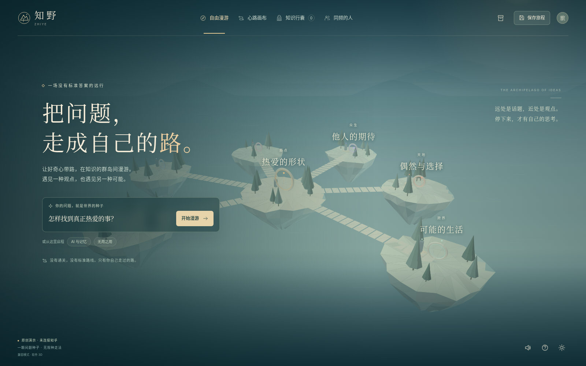

# 知野 ZHIYE

> 把问题，走成自己的路。问题是世界的种子；行囊里的知识，应该彼此相遇。

一个可以本地运行的三维知识探索原型。包含前端、后端、数据库、原创程序化场景、双渲染器、知乎搜索适配、存档、知识组合、想法锚点、个人画布、公开路线及同频匹配，以及测试和部署文件。不是仅有界面截图的静态概念稿。



## 0. 先明确交付边界

| 项目 | 本次交付状态 |
| --- | --- |
| 三维漫游、问题种子、稳定扩图、阅读卡片、行囊组合、锚点、存档、画布 | 已实现 |
| 真正的服务器持久化、多访客隔离、公开路线、撤回、真实访客之间的匹配 | 已实现；不是虚构“同频用户”列表 |
| Three.js 增强渲染器 | 完整源码已提供，依赖固定为 `0.180.0`；本次环境未能下载 npm 依赖，**未实机验证该 GPU 路径** |
| 软件三维兼容渲染器 | 已实现并完成 Chromium 交互检查；截图均来自此路径 |
| 知乎真实 HTTP 搜索适配 | 按官方公开文档的 URL、Bearer、秒级时间戳实现；没有真实密钥，**未完成鉴权联调，beta 响应字段仍须对照 Skill 核验** |
| 官方 Skill ZIP | 本次下载未成功；提供原始地址、安全下载脚本与字段映射方案；不伪称已安装 |
| 知乎 OAuth、关注流、故事、知识、热榜、直答 Agent | **本版没有接通这些接口**；不伪造端点、成功登录或回答 |
| 刘看山、外部商用模型、HDRI、字体包 | **未包含**；已提供原创场景及素材台账，没有未经授权的资源 |
| 部署 | 提供本地运行与 Docker 文件；**没有替你部署线上服务，Docker 构建尚未执行验证** |

默认 `demo` 模式只使用本项目原创示例文字，明显标为“原创演示 · 未连接知乎”。切换 `live` 后，真实接口失败会显示错误，不会悄悄用演示文字冒充知乎结果。

## 1. 快速启动

建议 Python 3.11+；本次后端检查环境为 Python 3.13。Three.js 路径需要 Node.js 20.19+ 或 22；纯软件兼容模式不需要 Node。不要双击 `index.html`：需要通过服务器访问。

### macOS / Linux

```bash
cd 漫知录
python -m venv .venv
source .venv/bin/activate
python -m pip install -r requirements.txt
cp .env.example .env

# 推荐：安装 Three.js，开启增强渲染。外网可用时执行。
npm install

python run.py
```

浏览器打开 `http://127.0.0.1:8000`。

### Windows PowerShell

```powershell
cd 漫知录
py -m venv .venv
.\.venv\Scripts\python.exe -m pip install -r requirements.txt
Copy-Item .env.example .env
npm install
.\.venv\Scripts\python.exe run.py
```

**npm 下载不可用时**，跳过 `npm install` 仍能启动软件三维版本。稍后安装成功，需要重启 Python 服务器，才会挂载 Three.js 的静态目录。不是需要手工改前端代码才能运行。

依赖首次安装需要联网；安装完后，演示模式不依赖公网 CDN、字体、纹理或知乎账号。实时模式当然仍需要连接知乎。

改端口或通过其他域名访问时，同时修改 `.env` 中的 `ZHIYE_ALLOWED_ORIGINS`，否则安全检查可能拒绝写入。通过公网使用时请先阅读“上线前必须补齐”。

### Docker

```bash
cp .env.example .env
docker compose up --build
```

默认仅映射到本机回环地址，不会主动暴露到公网。数据库在命名卷 `zhiye-data` 中。构建需要联网安装依赖。正式发布应审计并固定传递依赖锁文件；本包未生成未经安装验证的 `package-lock.json`。

## 2. 怎样完整体验一轮旅程

在首页保留“怎样找到真正热爱的事？”或者填写新问题，点击开始。进入起点后阅读身边的原创演示片段；按 E 收入行囊。沿桥走向“自我认知”等岛屿，停留后出现内容及三个新方向。再收集一张卡。

按 B 打开行囊，选中 2–4 张卡，选“互相补充 / 形成分歧 / 跨界类比 / 因果假设”，写至少六个字说明联系，再生成“新问题 / 观点草稿 / 行动实验”。产物不是引用，也不被标为已证实事实；原卡片、来源 ID、联系类型和你的解释全部保留。

按 R 留下想法，默认仅自己可见。按 M 打开画布：金色线记录探索，紫色线连接组合卡的来源话题，虚线表示候选方向。点击话题，再点击“去这里看看”，可以直接抵达，不必强行步行。

保存旅程后，在“同频的人”中查看公开范围预览，主动勾选确认并公开。用另一个浏览器/隐私窗口创建独立访客，探索并公开一条路线，双方才会进入真实匹配列表。单人使用时列表为空，这是正常行为，不是数据未加载。

### 操作

| 操作 | 方式 |
| --- | --- |
| 移动 / 加速 | WASD 或方向键 / Shift |
| 视角 | 点击场景后锁定鼠标；未锁定时可拖拽 |
| 释放鼠标 | Tab / Esc |
| 阅读附近第一张卡 | F；或释放鼠标后点击卡片 |
| 收纳附近第一张卡 | E |
| 想法锚点 / 行囊 / 画布 | R / B / M |
| 触屏 | 左侧方向按钮、场景拖拽、底部导航；也可以地图直达 |
| 暂停人物移动 | 打开任意阅读、行囊或设置面板时自动暂停 |

“减少动态效果”关闭背景漂移与水面动画，并关闭 GPU 泛光；没有镜头摇晃和强制跳跃。页面失焦会清除移动键状态。

## 3. 项目结构

```text
漫知录/
├── README.md
├── run.py                         # 跨平台启动器
├── package.json                   # Three.js 0.180.0；浏览器原生 ESM
├── requirements.txt               # 后端运行依赖
├── requirements-dev.txt           # pytest、Playwright
├── .env.example
├── Dockerfile / compose.yaml
├── backend/
│   ├── main.py                    # API、会话、所有权、公开/撤回、审核
│   ├── world.py                   # 确定性布局、增量扩图、公开投影、匹配
│   ├── content.py                 # 原创示例、知乎 HTTP/CLI 适配、来源清洗
│   ├── store.py                   # SQLite/WAL、缓存、原子额度预留
│   ├── config.py / models.py
│   └── schema.example.json        # 字段映射格式示例，不是已核验的官方契约
├── web/
│   ├── index.html / style.css
│   ├── assets/mark.svg            # 原创山形标记
│   └── js/
│       ├── app.js                 # 旅程工作流与面板
│       ├── core.js                # 采样、组合、来源链、导出等纯逻辑
│       ├── world-view.js          # 第一人称、碰撞、标签、驻留触发
│       ├── scene-data.js          # 原创几何、植被、桥梁、门环
│       ├── math.js / graph.js     # 投影、二维个人画布
│       ├── api.js / ui.js         # 同源 API、本地备份、可访问 UI
│       └── renderers/
│           ├── three.js          # WebGL2、材质、阴影、水面、泛光、实例化
│           └── software.js       # 无外部依赖的透视三维兼容实现
├── scripts/
│   ├── fetch_official_skill.py    # 下载、限体积、检查路径；不执行 Skill
│   ├── probe_zhihu.py             # 显式允许后，仅一次真实接入探测
│   ├── check.mjs                  # JavaScript 语法检查
│   ├── bundle-preview.cjs         # 受限环境测试专用；非生产入口
│   ├── smoke_http.py              # 独立 Uvicorn + 真实回环 TCP 检查
│   └── smoke_browser.py           # 受限环境 Chromium + ASGI 交互检查
├── tests/
│   ├── core.test.mjs
│   └── test_backend.py
├── docs/
│   ├── ARCHITECTURE.md
│   ├── ZHIHU_INTEGRATION.md
│   ├── THIRD_PARTY_ASSETS.md
│   └── TEST_REPORT.md
├── previews/                      # 实际界面截图与测试结果
└── data/.gitkeep                   # 运行时自动生成 SQLite 数据库
```

详见 [架构设计](docs/ARCHITECTURE.md)、[知乎接入说明](docs/ZHIHU_INTEGRATION.md)、[素材台账](docs/THIRD_PARTY_ASSETS.md)。

## 4. 为什么是这套技术

前端采用 **Three.js + 原生 JavaScript ESM + DOM/CSS + SVG**。Three.js 是三维主引擎；普通阅读和操作使用 DOM；路径画布使用 SVG。没有为了几张面板引入整套 React 状态树，也没有把逐帧相机更新交给界面组件重新渲染。这里不是 React Three Fiber 工程，请勿按 R3F 的依赖组合安装。

三维层负责“方位、距离、接近与关系”；二维层负责“文字阅读、组合、编辑与来源”。中文标签使用系统字体的 DOM 投影，不依赖运行时下载 CJK 字库。渲染器共享相同的世界结构和控制逻辑，切换引擎不改变旅程、存档或知识图。

后端采用 **FastAPI + Pydantic + SQLite/WAL**。这是单进程黑客松部署的选择，不包装成大规模在线服务。额度、缓存、私有数据都在服务器端；页面没有 Access Secret。SQLite 原子事务保证多个访客共享一个开发者预算，不用前端计数冒充限额。

Three.js 的重复树木使用 InstancedMesh，减少相同几何/材质的 draw calls；这是官方文档列明的适用场景。主路径固定 r180 是本项目的兼容性选择，不代表当前最新发行版。参考：https://threejs.org/docs/pages/InstancedMesh.html 。

## 5. 数据模式和真实接入

```dotenv
# 默认：完整交互 + 原创演示内容，不使用知乎额度
ZHIYE_MODE=demo

# 核验权限与响应结构后：
ZHIYE_MODE=live
ZHIHU_ACCESS_SECRET=仅在本机或服务器填写
ZHIYE_PROVIDER=http
```

公开文档已经核实搜索请求 URL、`Query`、Bearer 以及秒级 `X-Request-Timestamp`。没有拿到 beta Skill 和真实样本，因此字段映射不视为已经验证。请先运行官方 Skill 下载脚本，再核对 `backend/schema.example.json` 的路径；只在确实需要覆盖字段时配置 `ZHIHU_SCHEMA_FILE`。

```bash
python scripts/fetch_official_skill.py
# 先核对下载结果与官方说明，设置好 .env，再显式消耗一次真实搜索预算：
python scripts/probe_zhihu.py --live --query "如何发现自己的兴趣"
```

不要把真实密钥提交 Git、放进前端变量、发送到截图或输入框。默认所有知乎真实摘要都标成 `search_summary`，不是“逐字金句”。只有拿到许可范围内的正文且验证了对应文本区间，才有条件新增 `exact_quote` 类型；本版不会凭模型生成文本伪造引文。

## 6. 自动化验证

```bash
python -m pip install -r requirements-dev.txt
npm install
npm test
npm run check
python -m pytest -q
```

本次结果：**10 项 JS 领域测试、14 项 Python 测试通过**。测试证明的是所列场景，不是全量安全审计或生产验收。

界面检查因环境禁止浏览器访问 localhost/file URL，使用真实 Chromium 渲染前端、FastAPI TestClient 处理 API、内存模拟浏览器存储。软件三维路径实际执行了开始、访问、收集、组合、锚点、画布、保存和移动暂停；详见 [测试报告](docs/TEST_REPORT.md)。另通过了独立 Uvicorn + 真实回环 TCP 接口检查。本次未验证真实 IndexedDB、浏览器网络层部署、Three GPU 材质或官方实时 API。

测试脚本 `smoke_browser.py` 为这个受限环境编写，不是正常产品的入口；正常浏览器验收请启动 `run.py` 后直接访问本机地址。脚本默认 Chromium 位于 `/usr/bin/chromium`，可通过 `CHROMIUM_PATH` 修改。

## 7. 隐私与社区边界

会话使用随机不透明 Cookie，数据库只保留令牌哈希。不是知乎 OAuth，不能用于宣称已贡献活动要求的知乎登录数。访客身份仅在同一个浏览器 Cookie 下持续，清空 Cookie 会失去此访客服务器记录的访问入口。

私人锚点、行囊、连续坐标和解释文字不会进入公开路线。发布只生成白名单快照：**别名、种子问题、已访问话题及其图边**。种子问题本身也可能包含隐私，公开前界面有确认。分享后继续探索不会自动扩大公开范围，需主动更新快照。撤回使旧链接失效。

申请公开的锚点先进入 `pending`，只有持服务端管理员密钥的审核动作才能进入 `approved`。暂未提供完整内容安全服务或管理员可视化后台；不要在无人审核时向公众开放公共锚点。应用没有自动向知乎发布内容、关注、点赞或发私信的逻辑。

匹配依据主动公开的话题与图边，不做人格、身份或情绪诊断。这里的“同频”是产品表达，不是心理测量结论。

## 8. 上线前必须补齐

本包是可以运行、继续开发和演示的原型，不是未经验证即可大规模公开的成品。

首先完成官方 Skill、真实响应样本、活动授权与知乎 OAuth 接入；再完成同站 HTTPS、Secure Cookie、依赖锁定、日志脱敏、备份恢复演练、审核队列、申诉与内容撤回策略、用户数据保存期限以及隐私告知。

多人高并发时，迁移到 PostgreSQL 与 Redis：缓存、全局限额和 distributed singleflight 不能依赖进程内任务表。当前建议仅运行一个 Uvicorn worker。访客每日 80 次是本应用自定预算，不是平台授权凭据；更换访客会话可能规避访客预算，但不能绕过该 SQLite 数据库内的开发者总预算。公网仍需反滥用措施。

当前最多 64 个话题节点、深度 3，采用可解释规则提出探索问题，不宣称已经为知乎全站构建语义知识图。大世界流式加载、真正的主题语义抽取、多模态素材管线、实时多人共游以及 AI 推理生成均不在本版范围内。

## 9. 许可

原创代码、程序化美术与演示文案按 [MIT](LICENSE) 提供。第三方依赖保留各自许可证。知乎内容、商标、官方 Skill、刘看山不因本仓库的许可证而获得使用授权。没有提供任何字体文件。
